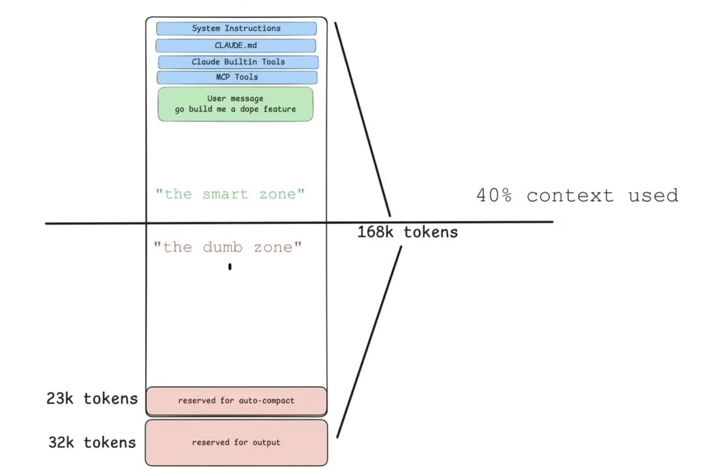
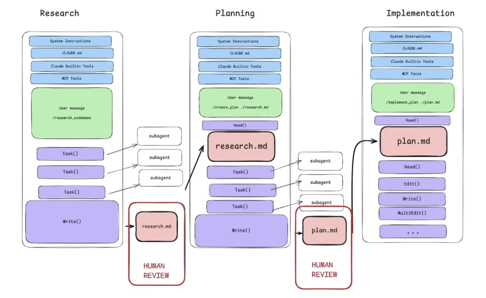
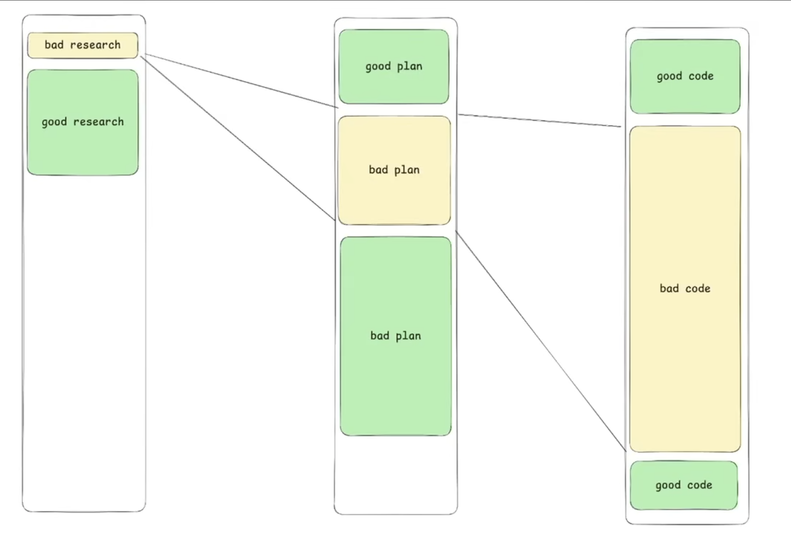

# 실무 경고: No Vibes Allowed의 핵심 메시지

<KeyMessage message="도구만 바꾸지 말고, SDLC 재설계가 필요" />

- 배경
  - 더 많이 배포했는데 팀이 왜 더 피곤하지?
  - 프로젝트 타입에 따른 어려움
    - 브라운필드(Brownfield: 기존 프로젝트)·레거시(Legacy) 환경에서 코드 재작업과 기술 부채 누적 위험
    - 그린필드(Greenfield: 신규 프로젝트)에서는 빠르게 보이지만, 후속 개발이 진행되면서 정리 비용 증가
- No Vibes Allowed: AI를 이용한 소프트웨어 개발에서 '단순한 느낌(Vibes)'이나 '운'에 기대는 방식을 버리고, 엄격한 공학적 접근(Context Engineering)을 취해야 한다.
- 결론: 도구 교체만으로는 부족, 소프트웨어 개발 생명주기(Software Development Life Cycle, SDLC) 재설계 필요

<SourceNote text="No Vibes Allowed: 00:55~02:40, 19:09~19:53" />

<!--
발표 스크립트

개인적으로 이 발표가 인상적이고 기억에 남았는데요. 내용에는 많은 팀이 실제로 겪는 현상을 언어화해서 공유한 부분이 좋았습니다.
"더 많이 배포했는데 팀이 왜 더 피곤하지?"라는 질문에 대해,
생성량 증가와 재작업 증가가 동시에 일어나는 구조를 보여줬습니다.
새로운 프로젝트에서도 처음에는 뭔가 잘 되는 것처럼 보이지만 잘 안 되는 지점이 생기고, 기존 프로젝트에서 잘 동작하지 않는 문제를 다들 겪고 계실 거 같습니다.
핵심은 AI를 쓰지 말자는 것이 아니라, 프로세스를 바꾸지 않은 채 사용량만 늘리면 역효과가 날 수 있다는 경고입니다.
이 메시지가 SASE의 구조 제안과 직접 연결됩니다.
-->

---

# 원칙 1: 컨텍스트 품질이 성능을 결정한다

**에이전트 결과가 흔들리는 이유는?**  
오해: 모델 성능? → 실제: **컨텍스트 품질**

<KeyMessage message="에이전트 성능은 모델이 아니라 컨텍스트 품질이 좌우한다." />

**Performance = (Correctness² × Completeness) / Size**

- **Correctness²**: 잘못된 정보는 제곱으로 성능에 반영 → 가장 치명적
- **Completeness**: 누락은 보수적 행동을 유도하지만, 오류보다 위험도는 낮음
- **Size**(분모): 컨텍스트가 커질수록 성능 저하 — 매 턴 의사결정은 현재 컨텍스트에 지배됨

따라서 프롬프트 문장력보다 **컨텍스트 품질 관리 체계**를 먼저 갖추는 것이 우선이다.

- 성능 개선의 영역: LLM 모델의 영역, 개발 Agent의 영역, 개발자의 영역

<SourceNote text="No Vibes Allowed: 03:00~05:56" />

<!--
발표 스크립트

에이전트 결과가 흔들릴 때 모델을 의심하기 쉽지만, 실제로는 입력 컨텍스트 품질이 더 크게 작용합니다.
이 관계를 식으로 보면, 잘못된 정보는 조금만 들어가도 성능이 크게 떨어지고, 크기는 컨텍스트가 길어질수록 성능이 나빠집니다.

그래서 팀은 "프롬프트" 문장력보다 컨텍스트 품질 관리 "체계"를 먼저 갖추는 것이 우선입니다.
다음 원칙에서는 컨텍스트가 길어졌을 때 무엇을 해야 하는지, 덤 존과 의도적 압축을 보겠습니다.
-->

---

# 원칙 2: 덤 존(Dumb Zone) 진입 전 의도적 압축

<KeyMessage message="컨텍스트가 길어지면 핵심만 압축해 새 세션을 시작하라." />

- 컨텍스트 창 점유율 증가 시 품질 저하 발생
- 의도적 압축(Intentional Compaction): 핵심 파일·라인·테스트 근거만 압축해 세션 재시작

{width=50%}

<SourceNote text="No Vibes Allowed: 03:47~07:16, 13:17~14:40" />

<!--
발표 스크립트

의도적 압축의 핵심은 토큰 절약이 아닙니다. 품질 보존이 핵심입니다.
컨텍스트가 길어질수록 관련 없는 이력이 섞이고, 모델의 다음 선택에 정확도가 떨어집니다.
그래서 "계속 대화 이어가기"보다 "핵심만 압축해 새 세션 시작"이 더 안정적일 때가 많습니다.

-->

---

# 작은 수정 방식의 실패의 구조

<KeyMessage message="구조 영향이 있으면 의도적 압축 후 RPI로 전환하라." />

- 반복 수정 루프(Repeated Correction Loop): 같은 세션에서 `요청→오답→지적→재오답` 반복 시 잘못된 궤적 강화
- 슬롭 재작업(Slop Rework): 작은 변경 실패가 코드베이스 churn과 기술 부채 증가로 확장
- 덤 존(Dumb Zone): 컨텍스트 점유율 40% 전후에서 정확도 저하, 도구 선택 오류, 엉뚱한 수정 가능성 증가
- 운영 원칙: 구조 영향이 있으면 의도적 압축 후 RPI로 전환
  - (예외: 버튼 색상 변경 수준의 단순 UI 수정은 즉시 지시로 처리 가능)

<SourceNote text="No Vibes Allowed 00:38~01:15, 02:44~06:05, 17:00~18:00" />

<!--
발표 스크립트

같은 세션 내에서 작은 수정이 반복되면 실패로 이어지는 경우가 많습니다
같은 대화창에서 오답을 계속 교정하면 잘못된 궤적이 누적되고, 컨텍스트 오염이 심해집니다.
여기에 테스트 출력이나 JSON 로그가 많이 쌓이면 덤 존에 들어가고 정확도와 도구 선택 품질이 함께 떨어집니다.
그래서 작은 변경이 단발성으로 끝나지 않고 재작업과 코드 전체의 혼란으로 확대됩니다.
다만 UI 버튼 색상 수정처럼 구조 영향이 거의 없는 작업은 바로 시켜도 됩니다.
핵심은 "작아 보이는 변경"이 아니라 "구조 영향이 있는 변경"인지 판단하는 것이고,
영향이 보이면 세션을 압축해 새로 시작하고 RPI라를 프로세스로 전환하는 것이 안전합니다.
-->

---

# 실행 패턴: 연구·계획·구현(RPI)

<KeyMessage message="RPI의 본질은 어디에 인간 시간을 써야 하는가를 재배치하는 것이다." />

- 연구(Research): 사실 - 코드 기반 사실 압축
- 계획(Plan): 의도 - 의도·순서·검증 압축
- 구현(Implement): 실행 - 승인된 계획 기반 저컨텍스트 실행

{width=50%}

<SourceNote text="No Vibes Allowed" />

<!--
발표 스크립트

RPI는 단순히 연구·계획·구현 세 단계를 나열한 게 아닙니다.
본질은 "인간 시간을 언제 어떻게 쓸지 재배치하는 것"입니다.

연구 단계에서는 작업과 관련된 현재 상황을 파악하는게 주 내용입니다. 코드를 많이 읽는 것이 아니라, 코드 기반 사실을 압축합니다.
계획 단계에서는 의도·순서·검증을 압축하고, 여기서 인간이 검토해 AI와 의도를 정렬합니다.
구현 단계는 이미 승인된 계획이 있으므로, 에이전트는 낮은 수준의 컨텍스트로 실행만 하면 됩니다. 이 단계에서는 인간의 개입이 거의 필요 없습니다.

RPI를 제대로 운영하려면 단계 이름보다 각 단계에서 나오는 산출물의 품질이 중요합니다.

-->

---

# RPI(Research, Plan, Implement) 산출물 기준(Artifact Standard)

<KeyMessage message="연구·계획·구현 각 단계에서 산출물 품질 기준의 예" />

- 연구 결과물(Research Output)
  - 관련 파일 목록
  - 코드 흐름
  - 정확한 참조 위치
- 계획 결과물(Plan Output)
  - 변경 단계
  - 코드 스니펫
  - 테스트 전략
- 구현 결과물(Implement Output)
  - 변경 내역
  - 실행 증거
  - 실패·재시도 기록

<!-- <SourceNote text="" /> -->

<!--
발표 스크립트

RPI의 각 단계의 산출물 기준을 통해 어떤 산출물 내용이 있어야하는지 가늠할 수 있습니다.
연구는 "많이 읽었다"가 아니라 "정확한 참조를 남겼다"가 기준입니다.
계획은 "대충 방향을 썼다"가 아니라 "누가 읽어도 실행 가능하다"가 기준입니다.
구현은 "코드가 생겼다"가 아니라 "검증 가능한 증거가 남았다"가 기준입니다.
이 기준이 있어야 리뷰가 취향 토론이 아니라 품질 감사가 됩니다.
-->

---

# 리뷰 재정의: 코드 감상에서 정신 정렬로

<KeyMessage message="먼저 계획과 근거를 검토하고, 그 다음 코드 디프를 보라." />

- 생산량 급증 시 코드만 읽는 리뷰는 확장 한계
- **계획/근거 선검토가 필수**
- 앞 단계의 영향이 크다
{width=50%}

<SourceNote text="No Vibes Allowed 14:56~17:40" />

<!--
발표 스크립트

생성량이 2~3배가 되면 과거 방식의 코드 리뷰는 반드시 병목이 됩니다.
리뷰어가 다양한 매번 맥락을 처음부터 파악해야 하기 때문입니다.

이제는 리뷰 순서를 바꿔야 한다고 말합니다. 계획과 근거를 먼저 검토한 뒤 코드 디프를 보면, 인지 부하를 줄이고 중요한 설계 판단에 시간을 더 쓸 수 있습니다.
-->

---

# 실무 패턴과 연구 프레임 연결

<KeyMessage message="실무 사례에서 질문을, 다음으로 나올 연구가 구조를 제시" />

| 실무 패턴 | 연구 SASE | 기대 효과 |
|---|---|---|
| 연구·계획·구현(RPI) | 브리핑 엔지니어링(BriefingEng) + 에이전틱 루프 엔지니어링(ALE) | 재현성 향상 |
| 계획 파일 중심 협업 | 브리핑 스크립트(BriefingScript)·루프 스크립트(LoopScript) | 추적성 향상 |
| 정신 정렬 리뷰 | 병합 준비 팩(MRP) + 상담 요청 팩(CRP) + 버전 관리 해상도(VCR) | 리뷰 병목 완화 |
| SDLC 재설계 | AI 팀원 수명주기 엔지니어링(ATLE) + AI 팀원 인프라 엔지니어링(ATIE) | 장기 지속성 |

<SourceNote text="출처(원문): §4~§5, §7; No Vibes Allowed Transcript" />

<!--
발표 스크립트

이 표가 오늘 발표의 연결점입니다.
발표 영상이 현장에서 발견한 실천 패턴은 이미 의미가 있습니다.
다음에 나올 논문의 가치는 그 실천을 조직 확장 가능한 구조로 형식화했다는 데 있습니다.

실무가 질문을 만들고, 연구가 구조를 제시하고 있습니다.
이제 이 실무 패턴을 연구 쪽에서 어떻게 문제로 보고 공통 언어를 제시하는지, 논문의 취지와 문제 인식부터 이어서 보겠습니다.
-->
