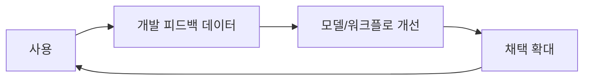

# 연구 — SASE 논문으로

<KeyMessage message="No Vibes Allowed 실무 패턴을 SASE 논문의 문제 인식과 구조로 이어서 본다." />

- 앞에서 본 No Vibes Allowed 실무 패턴을, SASE 논문의 **문제 인식**과 **핵심 구조**로 이어서 살펴봅니다.

<!--
발표 스크립트
앞에서 본 실무 패턴과 대응을, 논문은 이렇게 문제로 정의하고 공통 언어로 정리했습니다.
문제 인식부터 구조까지 차례로 보겠습니다.
-->

---

# 논문의 취지: 정답 제시가 아닌 공통 언어 제시

<KeyMessage message="정답이 아니라 에이전틱 SE 논의를 위한 공통 좌표계를 제시한다." />

- 핵심 문장: "definitive solution"보다 "conceptual scaffold" 제공
- 목적: 커뮤니티 전체 대화를 촉진
- 방향: 인간 중심 전제를 넘어 규율 기반 협업으로 이동

<SourceNote text="Abstract, §1" />

<!--
발표 스크립트
앞의 실무 패턴을 연구 쪽에서는 이렇게 문제와 목적으로 정의합니다.
이 논문은 "완성된 해답을 만들었다"고 주장하지 않습니다. 대신 에이전틱 소프트웨어 엔지니어링 논의에 필요한 공통 좌표계를 제안합니다.

도구가 너무 빠르게 변해서 고정된 정답 프레임이 금방 낡기 때문입니다. 그래서 논문은 기술 스택 고정안이 아니라 사고 구조와 용어 체계를 제안합니다.
발표도 이 취지를 따라, 구조와 개념 중심으로 이어가겠습니다.
-->

---

# 현재 트렌드의 문제: 기법은 폭발, 방법론은 공백

<KeyMessage message="한 번 잘 된 프롬프트가 아니라, 누가 해도 비슷한 품질이 나오는 체계가 필요하다." />

- 애드혹 실무 팁은 많아졌지만 검증된 방법은 부족
- 대화형 프롬프팅만으로는 장수명 소프트웨어 신뢰 확보가 어려움
- 결과: 1:1 에이전틱 코딩(개인기)에 머물고 N:N 에이전틱 소프트웨어 엔지니어링으로 확장 실패
- 시사점: 행위자, 프로세스, 도구, 산출물 재설계 필요

<SourceNote text="§1, §7.7" />

<!--
발표 스크립트

지금 현장은 팁과 트릭이 빠르게 늘고 있습니다.
하지만 그 팁이 재현 가능한 팀 표준으로 정착하는 경우는 많지 않습니다.
문제는 도구 성능보다 운영 방식입니다.
즉 "한 번 잘 된 프롬프트"가 아니라 "누가 해도 비슷한 품질이 나오는 체계"가 필요한 상황입니다.
논문은 이 지점을 정확히 짚습니다.
우리는 개인 생산성 패턴에서 팀 신뢰성 패턴으로 이동해야 하며, 이를 위해 네 가지 기둥을 다시 설계해야 한다는 주장입니다.
-->

---

# 80% 벽(80% Wall)

<KeyMessage message="컨텍스트 설계와 검증 시스템이 핵심." />

- **LLM 모델의 비결정적**  
  `temperature=0`도 무작위성 감소일 뿐, 완전한 결정성을 보장하지 않는다.
  단순 프롬프트로는 시스템 신뢰성을 일정 수준 이상 끌어올리기 어렵다.

- **과신과 도움 편향:**  
  RLHF(Reinforcement Learning from Human Feedback)는 모델이 모르는 것도 아는 척하게 만들어, 잘못된 확신을 줄 수 있다.

- **비용의 불균형:**  
  초기 80% 작성은 빨라지지만, 나머지 20% 신뢰 확보(검증·리뷰) 비용이 전체를 지배한다.

- **해결책:**  
  - 1. 더 나은 토큰 입력(컨텍스트)이 더 나은 출력을 만든다. 
  - 2. 프롬프트 문장력보다 검증 설계를 우선해야 한다.


<SourceNote text="No Vibes Allowed (Dex Horthy), 00:38~01:15, 05:26~06:05, 18:52~19:13" />

<!--
발표 스크립트
단순히 프롬프트를 잘 쓰는 것만으로는 시스템 신뢰성을 일정 수준 이상 끌어올리기 어렵습니다.
temperature가 0이어도 LLM 출력은 완전한 결정성을 보장하지 않고, RLHF는 과신을 유발할 수 있어 생성 결과에 대한 별도 검증과 보정이 필요합니다.

No Vibes Allowed에서 강조하듯, 유일한 레버는 컨텍스트입니다.
핵심은 컨텍스트 설계와 생성 결과를 안정적으로 검증하는 시스템입니다.
이 관점이 뒤에서 설명할 증거 기반 병합 준비(Merge-Readiness) 개념으로 이어집니다.
-->

---


# 시장 전환 1: 모델 경쟁에서 워크플로 경쟁으로

<KeyMessage message="경쟁 단위는 모델 데모가 아니라 개발 흐름 점유다." />

- 경쟁 단위: 모델 데모 → 개발 흐름 점유
- 실무 의미: "누가 더 잘 생성하나"보다 "누가 더 많이 병합하나"가 중요
- 경영 관점: 실험이 아니라 운영 의제

<SourceNote text="§3.1" />

<!--
발표 스크립트
과거에는 모델 벤치마크 점수가 뉴스의 중심이었다면, 지금은 개발 현장 점유율이 핵심입니다.
도구가 실제 팀 프로세스에 얼마나 깊게 들어오는지가 경쟁력의 기준이 되었습니다.
이 변화는 조직 의사결정에도 영향을 줍니다.
이제 코딩 에이전트는 개인 생산성 도구 구매가 아니라, 소프트웨어 생산 라인 재설계 프로젝트로 다뤄야 합니다.
그래서 기술팀뿐 아니라 제품, 보안, 재무까지 함께 보는 거버넌스가 필요합니다.
-->

---

# 시장 전환 2: 데이터 플라이휠 경쟁

<KeyMessage message="사용량이 학습 데이터가 되는 플라이휠; 어떤 근거를 축적할지가 전략이다." />

- 사용량 자체가 학습 데이터로 Feedback Loop
- 도구 선택은 사용자 경험 문제가 아니라 데이터 전략
- 질문 변화: "어떤 모델을 쓸까?" → "어떤 근거를 축적할까?"



<SourceNote text="§3.1" />

<!--
발표 스크립트
시장에서는 기능이 좋아서 이기는 것이 아니라, 학습 속도가 빨라서 이기는 구조가 만들어지고 있습니다.
도구 사용 과정에서 발생하는 개발 데이터가 다음 세대 품질을 결정합니다.
따라서 조직 관점에서는 단기 생산성만 볼 수 없습니다.
장기적으로 어떤 산출물과 의사결정 기록이 자산으로 남는지까지 설계해야 합니다.
SASE가 아티팩트(Artifact) 중심 접근을 강조하는 이유도 바로 여기에 있습니다.
-->

---

# 속도 대 신뢰 간극: 이미 시작된 병목

<KeyMessage message="생성은 병렬로 빨라졌지만 검증은 직렬에 머물러 병목이 이미 시작되었다." />

- 생산성 지표
  - GitHub Copilot 승인 병합까지 중앙값 13.2분
  - Claude Code 승인 병합에서 신규 기능 비중 49.5%
- 신뢰성 지표
  - 에이전트 산출 풀 리퀘스트(PR) 다수가 리뷰 지연 상태
  - 병렬 생성 대비 직렬 리뷰 병목


<SourceNote text="§3.3, §3.4" />

<!--
발표 스크립트
핵심은 생산성 상승이 거짓이라는 뜻이 아닙니다.
오히려 생산성 향상은 분명하게 관측됩니다.
문제는 시스템 균형입니다.
생성은 병렬로 빨라졌는데, 검증과 의사결정은 여전히 사람 중심 직렬 처리에 머물러 있습니다.
그래서 개인 단위에서는 빨라져도 팀 단위 처리량은 기대보다 늘지 않거나, 때로는 더 느려집니다.
이 지점을 해결하지 못하면 도구가 좋아질수록 리뷰 피로도와 품질 리스크가 함께 증가합니다.
-->

---

# 테스트 통과와 병합 준비(Merge-Readiness)는 다르다

<KeyMessage message="테스트 통과는 필요조건일 뿐; 근거 묶음 중심으로 머지 기준을 바꿔야 한다." />

- 그럴듯한 수정 중 유의미 비율이 재검증에서 실패
- 단위 테스트 통과 후에도 광역 CI에서 회귀 발생
- 결론: 통과 여부 중심에서 증거 묶음 중심으로 전환 필요

<SourceNote text="§3.3" />

<!--
발표 스크립트
많은 팀이 테스트 통과를 품질의 종착점으로 해석합니다.
그러나 논문과 실무 관찰은 테스트 통과가 필요조건일 뿐 충분조건이 아님을 보여줍니다.
특히 에이전트가 만든 패치는 한 파일 문제를 빠르게 고치더라도, 시스템 전체 맥락을 놓치기 쉽습니다.
그래서 우리는 "통과했으니 머지"가 아니라 "근거가 충분하니 머지"로 기준을 바꿔야 합니다.
이 기준 전환이 바로 Merge-Readiness Pack으로 연결됩니다.
-->

---

# 공예에서 공학으로: 팀 신뢰성 중심 전환

<KeyMessage message="방법론 없는 자동화는 확장되지 않는다; 반복 가능한 브리핑·실행·검증 계약이 공학적 체계다." />

- AI native 개발: 개인기 -> 팀 시너지
  - 다른 분야와 마찬가지로 시스템화, 전문화
  - (초기에는 개인기만으로 팀 생산성 개선이 충분할 수도 있으나)
- 소프트웨어 엔지니어링(SE)의 본령: 일반 팀도 신뢰성과 경제성을 달성하게 만드는 것
- 에이전틱 소프트웨어 엔지니어링: 개인 보조 도구가 아니라 팀 협업 규율
- 핵심 자산: 살아있는 문서와 버전 관리된 계약

<SourceNote text="§1, §7.7" />

<!--
발표 스크립트
논문과 프로젝트 메시지를 합치면, 가장 중요한 문장은 "방법론 없는 자동화는 확장되지 않는다"입니다.
생산성 차이는 코드 타자량이 아니라 협업 설계 능력에서 나오며, 10x·100x 같은 숫자는 보편 실증치라기보다 상징적 표현으로 받아들이면 됩니다.
우리는 슈퍼 개발자만 있는 조직을 전제로 일할 수 없습니다.
그래서 좋은 팀은 개인의 재능을 재현 가능한 구조로 전환합니다.
에이전트 도입도 동일합니다.
일회성 프롬프트 성공담이 아니라, 반복 가능한 브리핑, 실행, 검증 계약을 만들 때 비로소 공학적 체계가 됩니다.
-->

---

# 연구 질문과 핵심 주장

<KeyMessage message="어떤 '인간-에이전트 협업 구조'가 신뢰를 만드는가가 조직 우선순위를 바꾼다." />

- 연구 질문
  - 인간-에이전트 협업을 어떻게 체계화해야 확장 가능하고 신뢰 가능한 SE를 만들 수 있는가?
- 핵심 주장
  - 1:1 에이전틱 코딩에서 N:N 에이전틱 소프트웨어 엔지니어링으로 전환 필요
  - 프롬프트 중심에서 아티팩트 중심(Artifact-centric)으로 전환 필요

<SourceNote text="§1, §6.3, §9" />

<!--
발표 스크립트

앞서 본 실무 경고와 팀 신뢰성 전환이, 논문에서 어떤 연구 질문으로 정식화되는지 보겠습니다.
논문은 도구 선택 문제를 상위 문제로 끌어올립니다.
"어떤 모델이 좋은가"보다 "어떤 협업 구조가 신뢰를 만든는가"를 묻습니다.
이 질문을 받아들이면, 조직의 우선순위가 달라집니다.
프롬프트 튜닝보다 브리핑 품질, 리뷰 체계, 의사결정 기록 체계가 더 중요한 투자 항목이 됩니다.
이 관점이 구조화된 에이전틱 소프트웨어 엔지니어링(Structured Agentic Software Engineering, SASE) 전체의 설계 원리입니다.
-->

---

# 에이전시(Agency)와 자율성(Autonomy): 소프트웨어 엔지니어링(SE) 단계 모델

<KeyMessage message="SE 2.0은 잘 만드는 자동화, SE 3.0은 잘 협업하는 구조가 핵심이다." />

- 에이전시(Agency): 주어진 목표를 수행하는 능력
- 자율성(Autonomy): 목표 자체를 정의·조정하는 능력

| 단계 | 이름 | 설명 |
|---|---|---|
| SE 1.0 | 수동 코딩 | 인간이 직접 구현 |
| SE 1.5 | 토큰 보조 | 자동완성 중심 |
| SE 2.0 | 작업 에이전틱 | 작업 단위 자동화 |
| SE 3.0 | 목표 에이전틱 | 목표 기반 다단계 실행 |
| SE 4.0 | 특화 자율 | 특정 도메인 고자율 |
| SE 5.0 | 범용 자율 | 범용 도메인 자율 |

<SourceNote text="§2" />

<!--
발표 스크립트

자동차 자율주행 단계 모델을 소프트웨어 엔지니어링 자동화에 맞춘 이 모델은 현재 위치를 진단하는 데 유용합니다.
우리 조직이 SE 2.0 수준인지, SE 3.0 수준인지에 따라 투자 항목이 완전히 달라지기 때문입니다.
SE 2.0은 "잘 만드는 자동화"가 핵심이고,
SE 3.0은 "잘 협업하는 구조"가 핵심입니다.
따라서 성숙도 진단 없이 도구만 바꾸면, 기대한 효과가 나오기 어렵습니다.
-->

---

# 왜 2.0에서 3.0으로 넘어가기 어려운가

<KeyMessage message="SE 3.0 전환 실패는 모델 성능보다 운영 복잡도와 의사결정 이력 부재에서 온다." />

`목표 모호성 × 시스템 규모 × 병렬도 × 비결정성`

- 오케스트레이션 "복잡도" 급증
- "인간 개입 타이밍" 최적화 난이도 증가
- "책임 추적" 요구 증가

<SourceNote text="§2, §3.2, §6.3; 개념식은 발표용 모델" />

<!--
발표 스크립트
SE 3.0 전환 실패는 대부분 모델 성능보다 운영 복잡도에서 발생합니다.
목표가 조금만 모호해도 병렬 실행 중 충돌이 생기고,
비결정성 때문에 같은 지시에서도 결과가 달라질 수 있습니다.
그래서 "누가, 언제, 왜"라는 의사결정 이력을 남기지 않으면 재현과 책임 추적이 어려워집니다.
SASE는 이 복잡도를 아티팩트 기반 제어점으로 다루려는 시도입니다.
-->

---

# 동기 사례: 7개 티켓, 28개 풀 리퀘스트(PR)

<KeyMessage message="인간의 경쟁력은 구현량이 아니라 '평가 설계'와 '선택 정확도'로 이동한다." />

- 인간은 코딩보다 자연어 명세 작성에 시간 집중
- 에이전트가 병렬로 다중 풀 리퀘스트(PR) 생성


<SourceNote text="§4.1" />

<!--
발표 스크립트

이 사례는 에이전트 시대의 작업 형태를 직관적으로 보여줍니다.
과거에는 하나의 구현안을 길게 다듬는 방식이 중심이었지만,
이제는 여러 후보를 빠르게 만들고 선택하는 방식으로 이동합니다.
이때 인간의 경쟁력은 구현량이 아니라 평가 설계와 선택 정확도입니다.
즉 관리해야 할 대상이 코드 라인 수가 아니라 의사결정 품질이 됩니다.
-->

---

# 갭 1: 브리핑 부재와 즉흥 입력

<KeyMessage message="품질의 선행지표는 브리핑 품질이다; 브리핑을 1급 아티팩트로 올려야 한다." />

- 기존 문제: 티켓 복사 + 즉흥 지시로 목표·제약·검증이 분리
- 제안(SASE): 브리핑 스크립트(BriefingScript)
  - 목표와 이유
  - 성공 기준
  - 필수 맥락
  - 구현 청사진
  - 검증 루프

<SourceNote text="§4.2.1, §5.1" />

<!--
발표 스크립트

좋은 브리핑은 프롬프트 길이의 문제가 아닙니다.
실행 계약의 명확성 문제입니다.
브리핑이 약하면 이후 단계에서 보정 비용이 폭증합니다.
반대로 브리핑이 명확하면 구현 모델이 달라도 품질 편차를 줄일 수 있습니다.
SASE가 브리핑을 1급 아티팩트로 올린 이유는, 품질의 선행지표가 브리핑 품질이기 때문입니다.
-->

---

# 갭 2: 멘토링 비구조화

<KeyMessage message="리뷰 지식을 규칙으로 전환해 팀 자산으로 만든다; MentorScript가 그 장치다." />

- 기존 문제
  - 리뷰 코멘트가 산발적
  - 같은 실수 반복
  - 팀 규범이 암묵지로만 존재
- 제안(SASE): 멘토 스크립트(MentorScript)
  - 규칙 버전 관리
  - 규칙 충돌 검출
  - 규칙 적용 근거 추적

<SourceNote text="§4.2.2, §5.3" />

<!--
발표 스크립트

기존 코드 리뷰는 그 순간의 품질을 높이는 데는 강하지만, 지식 누적에는 약합니다.
MentorScript는 리뷰 지식을 규칙으로 전환해 재사용 가능하게 만듭니다.
즉 "좋은 리뷰어의 머릿속"을 팀 자산으로 바꾸는 접근입니다.
장기적으로는 에이전트가 반복 피드백 패턴을 학습해 규칙 후보를 제안할 수 있습니다.
이렇게 되면 멘토링도 운영 가능한 공정이 됩니다.
-->

---

# 갭 3: 오케스트레이션 즉흥성

<KeyMessage message="LoopScript는 대화 흐름이 아니라 실행 프로토콜이다; 작업 워크플로우" />

- 기존 문제: 긴 마스터 프롬프트에 임시 지시를 누적
   - 즉흥 지시는 재현성을 떨어뜨린다.
- 제안(SASE): 루프 스크립트(LoopScript)
  - 표준 운영 절차(SOP) 선언
  - 작업 분해와 병렬화
  - 인간 참여 지점 지정
  - 산출물 형식 강제

<CollapsibleExample summary="LoopScript 예시 (개념적)">
이 예시는 "사용자 인증 흐름에 대한 보안 취약점 점검 및 개선"이라는 작업을 위한 LoopScript를 가정합니다.

```yaml
# LoopScript: security_audit_user_auth_flow.loop

# 작업의 목적과 중요도를 정의합니다.
purpose: "Perform a comprehensive security audit of the user authentication flow and implement necessary improvements."
priority: "High" # 작업의 우선순위 (e.g., Low, Medium, High)
safety_critical: true # 이 작업이 안전에 직결되는지 여부

# 에이전트의 워크플로우를 단계별로 정의합니다.
stages:
  - name: "Static Code Analysis"
    description: "Perform static code analysis to identify common security vulnerabilities in authentication-related code."
    agent_type: "SecurityScannerAgent" # 이 단계를 수행할 에이전트 타입
    input_artifacts:
      - BriefingScript: "security_audit_user_auth_flow.brief" # 작업의 기본 지침
      - Codebase: "authentication_module" # 분석 대상 코드베이스 또는 모듈
    tools:
      - "SonarQube"
      - "Checkmarx"
    output_artifacts:
      - StaticAnalysisReport: "static_analysis_report.json"
    on_completion: "Continue" # 완료 후 다음 단계로 진행

  - name: "Vulnerability Assessment & Prioritization"
    description: "Analyze the static analysis report and prioritize identified vulnerabilities based on severity and exploitability."
    agent_type: "VulnerabilityAssessorAgent"
    input_artifacts:
      - StaticAnalysisReport: "static_analysis_report.json"
    # 에이전트가 취약점을 평가하고 우선순위를 매기는 데 사용할 내부 로직을 정의할 수 있습니다.
    heuristics:
      - "Severity > High and Exploitability > Medium -> Priority 1"
      - "Severity = Medium and Exploitability = Low -> Priority 3"
    output_artifacts:
      - PrioritizedVulnerabilities: "prioritized_vulnerabilities.json"
    on_completion: "Continue"

  - name: "Patch Generation - Critical Vulnerabilities"
    description: "Generate code patches for high-priority vulnerabilities."
    agent_type: "AutonomousCodingAgent"
    input_artifacts:
      - BriefingScript: "security_audit_user_auth_flow.brief"
      - PrioritizedVulnerabilities: "prioritized_vulnerabilities.json"
    # N-version programming을 사용하여 여러 해결책을 탐색합니다.
    n_version_count: 3 # 생성할 패치 버전 수
    constraints:
      - "Focus on OWASP Top 10 vulnerabilities."
      - "Avoid introducing regressions in core authentication logic."
    output_artifacts:
      - GeneratedPatches: "critical_vulnerability_patches/" # 패치 파일들이 저장될 디렉토리
    on_completion: "HumanReviewRequired" # 이 단계 후에는 인간의 검토가 필요합니다.

  - name: "Human Review - Critical Patches"
    description: "Human review of critical vulnerability patches. Coach provides feedback or approves."
    agent_type: "HumanCoach" # 이 단계를 수행하는 것은 인간 코치입니다.
    input_artifacts:
      - GeneratedPatches: "critical_vulnerability_patches/"
      - PrioritizedVulnerabilities: "prioritized_vulnerabilities.json"
    # 인간 코치가 CRP를 생성하거나 MRP를 승인하는 등의 액션을 트리거할 수 있습니다.
    interaction_mode: "ConsultationRequestPack" # 에이전트가 CRP를 생성하여 인간에게 요청합니다.
    on_completion: "ConditionalContinue" # 인간의 응답에 따라 다음 단계로 진행하거나 반복합니다.

  - name: "Patch Generation - Medium/Low Vulnerabilities"
    description: "Generate code patches for medium and low-priority vulnerabilities (if critical ones were approved)."
    agent_type: "AutonomousCodingAgent"
    input_artifacts:
      - BriefingScript: "security_audit_user_auth_flow.brief"
      - PrioritizedVulnerabilities: "prioritized_vulnerabilities.json" # 이전 단계에서 우선순위가 낮은 취약점 포함
      - HumanFeedback: "human_feedback_on_critical_patches.vcr" # 인간 검토 후 피드백 (VCR 형식)
    n_version_count: 2
    constraints:
      - "Incorporate feedback from human review of critical patches."
    output_artifacts:
      - GeneratedPatches: "medium_low_vulnerability_patches/"
    on_completion: "HumanReviewRequired"

  - name: "Final Merge-Readiness Pack Assembly"
    description: "Assemble all approved patches and evidence into a final Merge-Readiness Pack."
    agent_type: "MRPAssemblerAgent"
    input_artifacts:
      - ApprovedPatches: "critical_vulnerability_patches/" # 승인된 패치
      - ApprovedPatches: "medium_low_vulnerability_patches/" # 승인된 패치
      - StaticAnalysisReport: "static_analysis_report.json" # 검증 증거
      - TestResults: "authentication_module_tests.log" # 테스트 결과
      - DocumentationUpdates: "authentication_module_docs.md" # 관련 문서 업데이트
    output_artifacts:
      - MergeReadinessPack: "user_auth_security_audit.mrp" # 최종 MRP
    on_completion: "SubmitForFinalReview"

# 이 워크플로우에 대한 최종 검토 및 승인 정책을 정의합니다.
final_review_policy:
  type: "EvidenceBasedOversight" # 증거 기반 감독
  criteria:
    - "Functional Completeness"
    - "Sound Verification"
    - "Exemplary SE Hygiene"
    - "Clear Rationale and Communication"
    - "Full Auditability"

# 멘토링 규칙(MentorScript)을 참조합니다.
mentorship_rules:
  - "security_coding_standards.mentor"
  - "least_privilege_principle.mentor"

# 에이전트 수명 주기 관리 (ATLE) 관련 설정 (예: 메모리 사용)
lifecycle_settings:
  memory_retention_policy: "session_based" # 세션 기반 메모리 유지
  proactive_maintenance_schedule: "idle_cycles" # 유휴 시간에 사전 유지보수 수행
```
</CollapsibleExample>

<SourceNote text="§4.2.3, §5.2" />

<!--
발표 스크립트

LoopScript의 핵심은 "대화 흐름"이 아니라 "실행 프로토콜"입니다.
복잡한 작업에서 즉흥 지시는 재현성을 크게 떨어뜨립니다.
반면 선언형 루프를 쓰면, 같은 작업을 다른 팀원이 수행해도 품질 편차를 줄일 수 있습니다.
또 운영 관점에서는 실패 지점 분석과 개선 실험이 쉬워집니다.
즉 LoopScript는 자동화를 위한 문서가 아니라, 품질을 위한 실행 설계도입니다.
-->

---

# 갭 4: 코드 리뷰에서 증거 리뷰로

<KeyMessage message="MRP는 근거를 제출물에 포함하게 해 리뷰 품질 분산을 줄인다." />

- 제안(SASE): 병합 준비 팩(MRP)
- 핵심 검증 축
  1. 기능 완결성
  2. 검증 타당성
  3. 엔지니어링 위생
  4. 설명 명확성
  5. 전체 감사 가능성

<SourceNote text="§4.2.4, §5.2, §5.4" />

<!--
발표 스크립트
MRP는 리뷰어의 일하는 방식을 바꾸는 장치입니다.
과거에는 리뷰어가 근거를 직접 찾아다녀야 했지만,
MRP는 근거를 제출물에 포함하도록 강제합니다.
이 변화가 중요한 이유는 리뷰 시간이 줄어서가 아니라,
리뷰 품질의 분산을 줄이기 때문입니다.
즉 누가 리뷰하든 일정 수준의 근거 기준을 유지할 수 있게 됩니다.
-->
