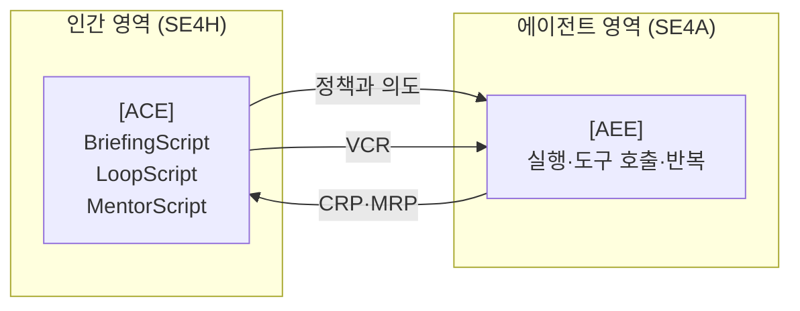
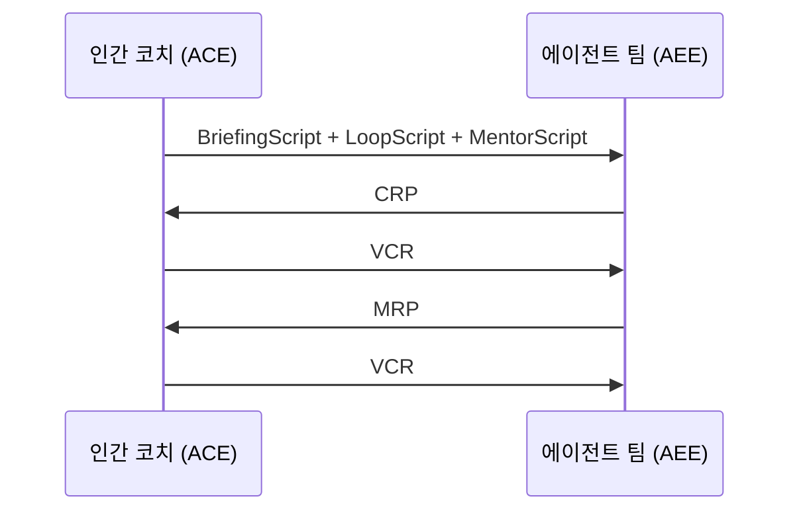

# SASE 한 장 요약

<KeyMessage message="SASE는 협업 단위를 재정의하는 운영 체계이며, 채팅이 아니라 아티팩트가 협업 인터페이스다." />

- 이중 모달리티
  - 인간용 SE(SE4H), 에이전트용 SE(SE4A)
- 이중 워크벤치
  - 에이전트 지휘 환경(ACE), 에이전트 실행 환경(AEE)
- 핵심 아티팩트
  - BriefingScript, LoopScript, MentorScript, CRP, MRP, VCR

<SourceNote text="Abstract, §4, §5" />

<!--
발표 스크립트
앞에서 본 갭들과 해법을 이제 구조로 한 장에 모아 보겠습니다.
SASE는 단일 도구나 단일 알고리즘이 아닙니다.
협업의 단위를 재정의하는 운영 체계입니다.
핵심 아이디어는 인간과 에이전트의 강점이 다르므로 작업 공간도 분리해야 한다는 점입니다.
또 협업 메시지를 채팅 로그에 묻어두지 않고, 구조화된 아티팩트로 남겨야 한다는 점입니다.
이 구조가 있어야 장기 운영과 감사 가능성이 생깁니다.
-->

---

# 이중 모달리티 아키텍처

<KeyMessage message="협업은 단방향 명령이 아니라 양방향 계약 구조다; 인간은 정책을 보내고 에이전트는 CRP·MRP로 응답한다." />

<SourceNote text="Fig.1, Fig.3, §4" />

<!--
발표 스크립트
중요한 포인트는 단방향 명령 구조가 아니라 양방향 계약 구조라는 점입니다.
인간은 목표와 정책을 보내고,
에이전트는 실행 결과뿐 아니라 의사결정 요청을 구조화해 되돌려 보냅니다.
인간의 판단은 다시 VCR로 기록되어 다음 실행을 제약합니다.
이 반복 루프가 팀 학습을 만듭니다.
즉 협업의 핵심 인터페이스가 채팅이 아니라 아티팩트라는 점을 기억하시면 됩니다.
-->

---

# 에이전트 지휘 환경(Agent Command Environment, ACE)

<KeyMessage message="ACE는 코드 편집이 아니라 의사결정 최적화와 팀 운영 관제탑이다." />

- 인간 중심 작업
  - 브리핑·루프·멘토 스크립트 작성과 버전 관리
  - 상담 요청 팩(CRP) 수신함 기반 라우팅
  - 다중 결과 비교와 합성
- 운영 관찰
  - 비용, 지연, 품질 가시화

<SourceNote text="§4.3.1" />

<!--
발표 스크립트
ACE는 기존 통합 개발 환경(Integrated Development Environment, IDE)의 대체재라기보다 상위 지휘 센터입니다.
핵심은 코드 편집 최적화가 아니라 의사결정 최적화입니다.
특히 여러 에이전트가 동시에 작업할 때,
누가 어떤 CRP를 받아야 하는지 자동 라우팅이 병목을 크게 줄입니다.
또 리더 관점에서는 비용과 품질의 균형을 실시간으로 확인할 수 있어야 합니다.
즉 ACE는 팀 운영의 관제탑 역할을 수행합니다.
-->

---

# 에이전트 실행 환경(Agent Execution Environment, AEE)

<KeyMessage message="AEE는 에이전트 친화 도구와 격리 실행으로 재현 가능한 실행을 보장한다." />

- 에이전트 친화 도구
  - 구조 편집, 시맨틱 탐색, 자동 검증 루프
- 실행 특성
  - 격리 실행, 저오버헤드 피드백, 보안·성능·비용 모니터링
- 상향 원칙: 인간 개입이 필요한 이벤트만 ACE로 전달

<SourceNote text="§4.3.2" />

<!--
발표 스크립트
현재 많은 팀이 인간용 도구를 그대로 에이전트에게 쓰게 합니다.
논문은 이 구조가 비효율적이라고 지적합니다.
에이전트는 인간과 다른 강점을 가지므로, 실행 환경도 다르게 설계해야 합니다.
핵심은 대규모 반복 실행과 빠른 피드백, 그리고 안전한 격리입니다.
또 모든 이벤트를 인간에게 올리는 것이 아니라,
정해진 기준을 넘는 이벤트만 올려 인지 부하를 관리해야 합니다.
-->

---

# 핵심 아티팩트 6종

<KeyMessage message="6종 아티팩트는 협업 계약을 저장하며, CRP·VCR은 인간 판단을 재사용 가능한 기록으로 바꾼다." />

- 브리핑 스크립트(BriefingScript): 목표·맥락·제약·검증 계약
- 루프 스크립트(LoopScript): 실행 절차와 엄격도 선언
- 멘토 스크립트(MentorScript): 팀 규범과 베스트 프랙티스 규칙화
- 상담 요청 팩(Consultation Request Pack, CRP): 인간 의사결정 요청
- 병합 준비 팩(Merge-Readiness Pack, MRP): 병합 판단 근거 번들
- 버전 관리 해상도(Version Controlled Resolution, VCR): 결정과 이유의 공식 기록

- 공통 요구사항: 버전 관리, 기계 가독, 감사 가능

<SourceNote text="§4, §5, §9" />

<!--
발표 스크립트
SASE를 실제로 도입할 때 가장 실용적인 진입점은 이 6개 아티팩트입니다.
각 아티팩트는 대화의 한 순간을 문서화하는 것이 아니라, 협업 계약을 저장하는 역할을 합니다.
특히 CRP와 VCR이 중요한 이유는 인간 판단을 "구두 피드백"에서 "재사용 가능한 기록"으로 바꾸기 때문입니다.
시간이 지날수록 이 기록은 팀의 운영 지식 베이스가 됩니다.
-->

---

# 협업 루프(Collaboration Loop): CRP-MRP-VCR

<KeyMessage message="인간 개입을 설계된 이벤트로 만들고, VCR은 다음 반복을 제약하는 정책이 된다." />

- 상담 요청 팩(CRP)은 질문 목록이 아니라 결정 옵션 제시 문서
- 버전 관리 해상도(VCR)는 책임 경로를 고정

<SourceNote text="§4, §5.4" />

<!--
발표 스크립트
이 루프를 도입하면 인간 개입이 무작위 인터럽트가 아니라 설계된 이벤트가 됩니다.
에이전트는 애매한 질문 대신 옵션과 근거를 갖춘 CRP를 제출해야 합니다.
인간은 VCR로 선택과 이유를 명시합니다.
이 기록은 단순 로그가 아니라 다음 반복에서 에이전트 행동을 제약하는 정책이 됩니다.
결과적으로 의사결정 품질이 개인 역량에 덜 의존하게 되고, 팀 수준 일관성이 올라갑니다.
-->

---

# 6대 엔지니어링 활동

<KeyMessage message="여섯 활동은 독립 모듈이 아니라 BriefingEng→ALE→ATME→AGE→ATLE→ATIE로 연결된 시스템이다." />

1. 브리핑 엔지니어링(Briefing Engineering, BriefingEng)
2. 에이전틱 루프 엔지니어링(Agentic Loop Engineering, ALE)
3. AI 팀원 멘토십 엔지니어링(AI Teammate Mentorship Engineering, ATME)
4. 에이전틱 가이던스 엔지니어링(Agentic Guidance Engineering, AGE)
5. AI 팀원 수명주기 엔지니어링(AI Teammate Lifecycle Engineering, ATLE)
6. AI 팀원 인프라 엔지니어링(AI Teammate Infrastructure Engineering, ATIE)

<SourceNote text="§5, §7" />

<!--
발표 스크립트
이 여섯 활동은 독립 모듈이 아니라 연결된 시스템입니다.
BriefingEng가 무엇을 할지 정의하고,
ALE가 어떻게 실행할지 정의합니다.
ATME는 왜 그렇게 해야 하는지 규범을 부여하고,
AGE는 인간 판단을 정확한 타이밍에 주입합니다.
ATLE와 ATIE는 이 구조를 단발성이 아닌 장기 시스템으로 유지하게 만듭니다.
-->

---

# 브리핑 엔지니어링(Briefing Engineering)과 에이전틱 루프 엔지니어링(Agentic Loop Engineering, ALE)

<KeyMessage message="BriefingEng는 실행 가능한 계약을, ALE는 그 계약을 운영 가능한 루프로 만든다; 실패 후 회복 비용이 핵심이다." />

- 브리핑 엔지니어링(BriefingEng)
  - 모호성 탐지, 검증 가능 수용 기준, 변경-요구 매핑
- 에이전틱 루프 엔지니어링(ALE)
  - 루프 스크립트(LoopScript) 설계
  - 인간 개입 후 재시작 비용 최소화
  - 병합 준비 팩(MRP) 자동 조립 파이프라인

<SourceNote text="§7.1, §7.2" />

<!--
발표 스크립트
BriefingEng는 좋은 문장을 쓰는 기술이 아니라, 실행 가능한 계약을 만드는 기술입니다.
ALE는 그 계약을 운영 가능한 루프로 만드는 기술입니다.
현장에서 특히 중요한 포인트는 "실패 후 회복 비용"입니다.
실패했을 때 전체를 다시 시작하면 비용이 커지므로,
중간 상태를 유지한 저비용 재실행 경로를 설계해야 합니다.
또 최종적으로는 MRP가 자동 생성되도록 해야 리뷰 비용이 통제됩니다.
-->

---

# 에이전틱 가이던스 엔지니어링(Agentic Guidance Engineering, AGE)와 인공지능 팀원 멘토십 엔지니어링(AI Teammate Mentorship Engineering, ATME)

<KeyMessage message="ATME·AGE는 인간 역량을 줄이는 게 아니라 증폭한다; 필요한 순간에 적합한 사람이 고품질 결정을 내리게 한다." />

- 에이전틱 가이던스 엔지니어링(AGE)
  - 점진적 공개 기반 상담 요청 팩(CRP) 인터페이스
  - 역할·전문성·업무량 기반 라우팅
  - 버전 관리 해상도(VCR) 학습 데이터화
- AI 팀원 멘토십 엔지니어링(ATME)
  - 멘토 스크립트(MentorScript) 언어·테스트·충돌 검출
  - 인간 피드백에서 일반 규칙 추론, 규칙 적용 설명 가능성

<SourceNote text="§7.3, §7.4" />

<!--
발표 스크립트
ATME와 AGE는 인간 역량을 줄이는 구조가 아니라, 인간 역량을 증폭하는 구조입니다.
ATME는 팀의 암묵지를 규칙으로 전환해 반복 실수를 줄입니다.
AGE는 인간 개입을 최소화하는 것이 목적이 아니라, 필요한 순간에 가장 적합한 사람이 가장 적은 맥락으로 고품질 결정을 내리게 하는 것이 목적입니다.
이 둘이 결합되면 인간 판단은 줄지 않지만, 낭비되는 판단은 줄어듭니다.
-->

---

# 인공지능 팀원 수명주기 엔지니어링(AI Teammate Lifecycle Engineering, ATLE)과 인공지능 팀원 인프라 엔지니어링(AI Teammate Infrastructure Engineering, ATIE)

<KeyMessage message="ATLE는 기억과 성장, ATIE는 실행과 통제; 이 둘이 없으면 에이전트 협업은 단기 데모로 끝난다." />

- AI 팀원 수명주기 엔지니어링(ATLE)
  - 단발성 실행기에서 장기 팀원으로 전환
    - 지속적 기억(persistent memory)
  - 결정 로그와 프로젝트 기억 축적, 유휴 자원 기반 선제 유지보수
- AI 팀원 인프라 엔지니어링(ATIE)
  - 에이전트들을 위한 운영 환경을 구축하고 관리하는 활동
  - 에이전트 네이티브 도구체인(Agent-Native Toolchain) 개발
  - 분산 컴퓨팅 패브릭 확장 및 최적화
  - 인간-에이전트 상호작용 인터페이스 설계
  - 에이전트 관리 및 모니터링 시스템 개발

<SourceNote text="§5.5, §7.5, §7.6" />

<!--
발표 스크립트
ATLE와 ATIE가 빠지면 에이전트 협업은 단기 데모로 끝나기 쉽습니다.
ATLE는 에이전트가 같은 실수를 반복하지 않도록 학습 경로를 제공합니다.
ATIE는 그 학습과 실행이 안전하고 재현 가능하게 돌아가도록 기반을 만듭니다.
특히 비용, 보안, 재현성을 동시에 다루지 않으면 실제 운영에서 확장되지 않습니다.
결론적으로 ATLE는 "기억과 성장", ATIE는 "실행과 통제"를 담당합니다.
-->

---

# 4대 기둥 재해석

<KeyMessage message="SASE는 기존 기둥을 새로운 행위자 구조에 맞게 재배치하며, 점진적 도입으로 혁신과 안정성을 동시에 확보한다." />

| 기둥 | 기존 관점 | SASE 관점 |
|---|---|---|
| 행위자 | 인간 개발자 중심 | 인간 코치 + 전문 에이전트 |
| 프로세스 | 팀 규칙 + 코드 리뷰 | 구조화된 인간-에이전트 루프 |
| 도구 | 단일 IDE | ACE + AEE |
| 산출물 | 코드·이슈·풀 리퀘스트(PR) | 계약형 스크립트 + 증거 팩 |

<SourceNote text="§1, §7.7" />

<!--
발표 스크립트
SASE는 기존 소프트웨어 엔지니어링을 부정하지 않습니다.
오히려 기존 기둥을 새로운 행위자 구조에 맞게 재배치합니다.
이 점이 실무에서 중요합니다.
완전히 새로운 조직을 만드는 것이 아니라,
기존 조직 구조를 점진적으로 재해석하는 방식으로 도입할 수 있기 때문입니다.
즉 혁신과 안정성을 동시에 확보할 수 있는 접근입니다.
-->

---

# 관련 접근 비교: PRP/PDAR, SuperClaude류, BMAD

<KeyMessage message="SASE는 기존 접근을 무시하지 않고, 조직 확장 시 필요한 증거·책임·수명주기 설계를 채우는 상위 프레임이다." />

| 접근 | 강점 | 한계 | SASE 확장 |
|---|---|---|---|
| PRP/PDAR | 단일 작업 루프 정교화 | 조직 수준 지속 거버넌스 부족 | 다중 행위자 계약 체계 추가 |
| CLI 툴킷 | 개인 효율 향상 | 멘토링·수명주기 구조 약함 | 규칙·수명주기·인프라 통합 |
| BMAD | 역할 기반 병렬화 | 환경·증거·책임 경로 형식화 한계 | ACE/AEE + CRP/MRP/VCR 정식화 |

<SourceNote text="§8.1, §8.2, §8.3" />

<!--
발표 스크립트
중요한 점은 SASE가 기존 접근을 무시하지 않는다는 것입니다.
PRP와 PDAR는 여전히 유효한 실무 자산입니다.
애자일 AI 주도 개발 혁신법(Breakthrough Method for Agile AI-Driven Development, BMAD) 역시 역할 분해 측면에서 강점이 분명합니다.
다만 논문은 이 접근들이 조직 규모로 확장될 때 필요한
증거 표준, 책임 경로, 수명주기/인프라 설계가 충분히 명시되지 않았다고 봅니다.
SASE는 이 빈칸을 채우는 상위 프레임 역할을 합니다.
-->

---

# SASE 차별점 5가지

<KeyMessage message="출력 기준을 코드 조각이 아니라 병합 준비 근거로 바꾸면 리뷰 초점이 스타일 논쟁에서 신뢰 판단으로 이동한다." />

1. 멘토십 코드화: 멘토 스크립트(MentorScript)로 리뷰 지식 누적
2. 이중 워크벤치: ACE와 AEE 분리
3. 산출물 기준 전환: PR 중심에서 MRP 중심으로
4. 상담 가능성 우선: CRP를 1급 아티팩트로 승격
5. 장기성 확보: ATLE + ATIE

> 위 다섯 가지가 SASE 정체성 요약.

<SourceNote text="§8.3" />

<!--
발표 스크립트
이 다섯 가지를 기억하면 SASE의 정체성을 빠르게 설명할 수 있습니다.
특히 세 번째 항목이 중요합니다.
출력의 기준을 코드 조각이 아니라 병합 준비 근거로 바꾸면, 리뷰 초점이 스타일 논쟁에서 신뢰 판단으로 이동합니다.
이제 SASE 구조를 마무리하고, 한계와 도입 시 유의점을 짚어보겠습니다.
-->
