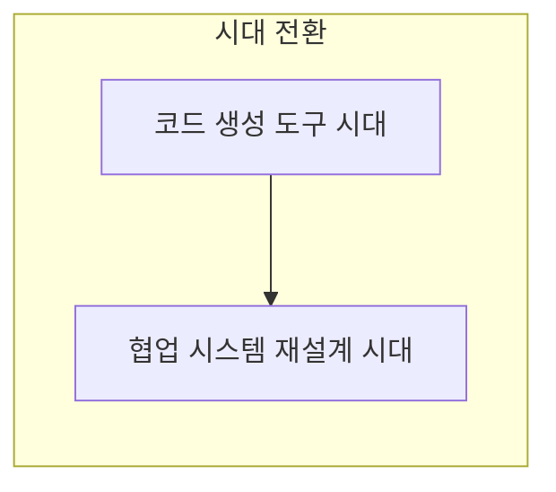
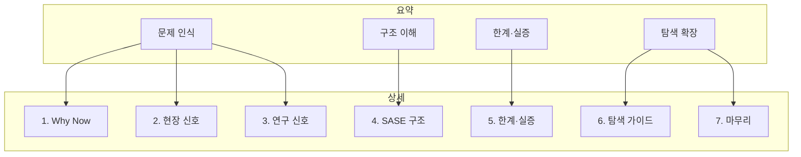

# 페러다임 전환

<KeyMessage message="코드 생성 도구 시대에서 협업 시스템 재설계 시대로의 전환을 배경으로 한다." />

<!--
발표 스크립트

이 발표에서는 현재 **코드 생성 도구 시대에서 협업 시스템 재설계 시대로** 개발 패러다임이 전환되고 있다는 시각을 가지고 있습니다.
단일 도구 활용을 넘어, 팀과 프로세스를 어떻게 설계할지가 핵심이 됩니다. 이 배경을 염두에 두고 발표 흐름을 보겠습니다.
-->

---

# 발표 Story Map

<KeyMessage message="발표 흐름: 문제 인식 -> 구조 이해 -> 한계와 실증 -> 후속 탐색 확장" />

1. Why Now: 왜 지금 이 주제가 중요해졌나
2. 현장 신호: No Vibes Allowed
3. 연구 신호: 논문 문제 인식과 SASE
4. SASE(Structured Agentic Software Engineering) 핵심 구조
5. 한계·리스크와 실증 설계
6. 탐색 가이드: 키워드·읽기 경로·교육·역할 전환
7. 마무리: 쟁점 언어 · 결론

<!--
발표 스크립트

발표 흐름은 크게 문제 인식 -> 구조 이해 -> 한계와 실증 -> 후속 탐색 확장 입니다
-->

---

# Reference

#### 참고 자료
- 실무: [No Vibes Allowed 발표(YouTube)](https://www.youtube.com/watch?v=rmvDxxNubIg)
- 연구 (주요 내용): [Agentic Software Engineering: Foundational Pillars and a Research Roadmap (2025)](https://arxiv.org/abs/2509.06216)

<!--
발표 스크립트
발표 내용은 위 두 자료를 기반으로 했습니다. 자세한 탐색은 각 페이지 말미의 참조를 참고해 주세요.
먼저 실무 쪽, No Vibes Allowed부터 보겠습니다.
-->
