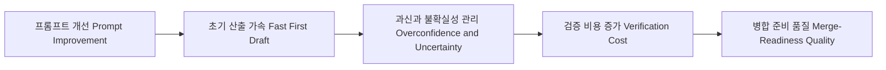
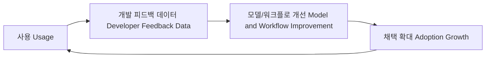
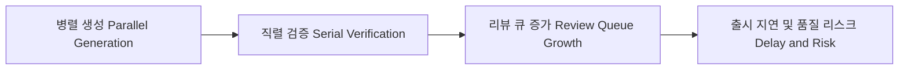
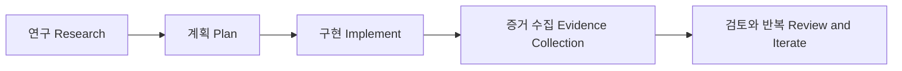
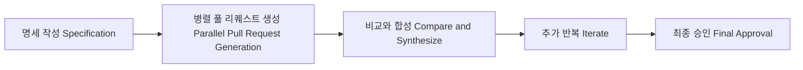
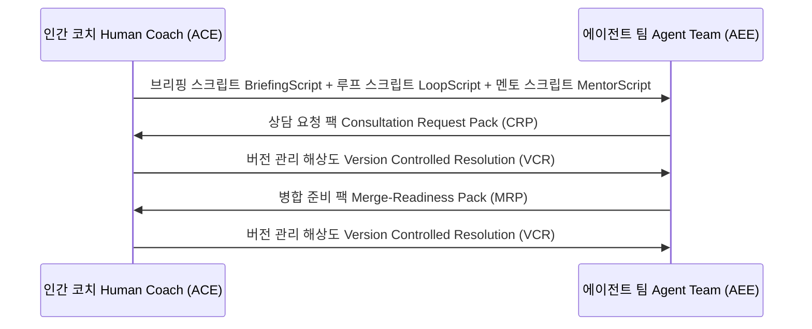

# Structured Agentic Software Engineering
## 코드 생성 도구(Code Generation Tool) 시대에서 
## **협업 시스템(Collaboration System) 재설계** 시대로

<br />

- 핵심 전환 질문: 빨리 만드는 것과 신뢰할 수 있는 배포를 동시에 달성할 수 있는가?
- 오늘의 관점: 모델 성능 비교가 아니라 AI Native 전환기를 읽는 개념 언어 정리
- 중심 프레임
  > 구조화된 에이전틱 소프트웨어 엔지니어링(Structured Agentic Software Engineering, SASE)

<!--
발표 스크립트
오늘 발표의 출발점은 "에이전트가 코드를 잘 쓰는가"가 아닙니다.
핵심은 "AI Native 전환기를 설명할 때 어떤 개념과 언어를 기준으로 삼을 것인가"입니다.
지금 시장에서는 코드 생성 속도는 이미 매우 빠르게 개선되고 있습니다.
하지만 속도만으로는 실제 서비스 품질, 운영 안정성, 팀 학습 속도를 보장하지 못합니다.
그래서 오늘은 도구 데모 중심 설명이 아니라, 협업 구조와 검증 구조를 중심으로 보겠습니다.
특히 Ahmed Hassan 연구팀의 SASE 논문과 No Vibes Allowed 실무 사례를 연결해, 현장 실천과 연구 프레임을 하나의 흐름으로 설명하겠습니다.
발표를 들으신 뒤에는 관련 자료를 다시 찾기 쉬운 키워드와 쟁점 언어를 확보할 수 있도록 구성했습니다.
-->

---

# 발표 목적(Objective)과 기대 산출물(Expected Output)

1. AI Native 전환기의 Software Engineering 흐름을 conceptual 관점에서 이해
2. 발표 후 관련 내용을 빠르게 재탐색할 수 있도록 핵심 키워드(Keywords)와 참조 축(Reference Axes) 정리
3. 쟁점을 토론할 때 반복 사용 가능한 질문 언어(Discussion Language) 확보

- 기대 산출물: 발표 종료 시점에 키워드 맵(Keyword Map)과 쟁점 질문 템플릿(Question Templates) 초안 확보

<!--
발표 스크립트
오늘 발표의 목표는 실행안을 정하는 것이 아니라, AI Native 전환기에서 Software Engineering 흐름을 해석하는 사고의 언어를 정리하는 것입니다.
첫째, 복잡한 논의를 따라갈 수 있도록 핵심 개념어를 공통 기준으로 맞춥니다.
둘째, 발표가 끝난 뒤에도 다시 찾아볼 수 있도록 검색 가능한 키워드 축을 남깁니다.
셋째, 찬반 토론에서 바로 쓸 수 있는 쟁점 질문 문장을 확보하는 데 집중합니다.
발표 마지막에는 결정안보다 탐색 프롬프트에 가까운 질문 목록을 남기겠습니다.
즉 오늘의 성공 기준은 "무엇을 실행할지"보다 "무엇을 기준으로 더 찾아볼지"를 명확히 하는 것입니다.
-->

---

# 자료 출처(Source)와 신뢰 구분(Confidence Level)

- 핵심 논문(Core Paper): [Agentic Software Engineering: Foundational Pillars and a Research Roadmap (2025)](https://arxiv.org/abs/2509.06216)
- 실무 보강(Practice Signal): [No Vibes Allowed 발표(YouTube)](https://www.youtube.com/watch?v=rmvDxxNubIg)

| 구분(Class) | 의미(Meaning) |
|---|---|
| 원문 근거(Direct Evidence) | 논문 본문 또는 발표 원문에서 직접 확인되는 내용 |
| 발표 해석(Interpretation) | 원문을 기반으로 실무 적용을 위해 확장한 내용 |
| 탐색 가이드(Exploration Guide) | 발표 후 추가 탐색을 돕기 위해 정리한 키워드/읽기 경로 |

<!--
발표 스크립트
이번 발표는 문헌 요약과 탐색 가이드를 명확히 분리합니다.
왜냐하면 연구의 주장과 발표자의 해석을 섞으면, 실행 단계에서 오해가 생기기 때문입니다.
원문 근거는 논문과 발표 원문에서 직접 확인되는 사실입니다.
발표 해석은 그 사실을 현업에 맞게 연결한 부분입니다.
탐색 가이드는 발표 후 스스로 읽어볼 자료와 키워드를 연결하기 위해 추가한 안내입니다.
이 구분을 유지하면, 토론 시 "무엇이 사실인지"와 "무엇을 선택할지"를 분리해서 의사결정할 수 있습니다.
-->

---

# 표기 규칙(Notation Rule): 약어(Acronym)와 이중언어(Bilingual)

- 약어(Acronym)는 등장할 때 원어 풀네임(Full Name)과 한글 의미를 함께 표기
- 영어(English) 핵심 용어는 한국어(Korean)와 병기
- 예시(Example)
  - 대규모 언어 모델(Large Language Model, LLM)
  - 인간 피드백 기반 강화학습(Reinforcement Learning from Human Feedback, RLHF)
  - 모델 컨텍스트 프로토콜(Model Context Protocol, MCP)

<!--
발표 스크립트
요청하신 기준에 맞춰 오늘 자료는 약어와 영어 표기를 최대한 명시적으로 처리했습니다.
이 방식은 슬라이드가 길어지는 단점이 있지만, 해석 오차를 줄이는 장점이 큽니다.
특히 여러 역할이 함께 듣는 자리에서는 약어를 당연하게 가정할수록 커뮤니케이션 비용이 증가합니다.
그래서 오늘은 용어를 축약하기보다, 의도적으로 풀어서 설명합니다.
이 원칙 자체가 SASE의 핵심 정신과도 맞닿아 있습니다.
즉 암묵지(Implicit Knowledge)를 줄이고, 명시지(Explicit Knowledge)를 늘리는 방향입니다.
-->

---

# 발표 이야기 지도(Story Map)

1. 왜 지금 이 주제가 구조적 필수인가(Why Now)
2. 현장 신호(Practice Signal): No Vibes Allowed와 연구 신호(Research Signal)
3. SASE(Structured Agentic Software Engineering, 구조화된 에이전틱 소프트웨어 엔지니어링) 핵심 구조
4. 후속 탐색 가이드(Post-talk Exploration Guide): 키워드와 읽기 경로
5. 토론 질문(Discussion Questions)과 쟁점 언어(Issue Vocabulary)

<!--
발표 스크립트
흐름을 먼저 제시하는 이유는, 오늘 내용이 단일 도구 소개가 아니라 시스템 설계 이야기이기 때문입니다.
초반에는 문제의 성격을 정의하고, 중반에는 구조적 해법을 설명합니다.
후반에는 발표 이후 추가로 찾아볼 수 있는 탐색 경로와 쟁점 언어를 다룹니다.
즉 "문제 인식 → 구조 이해 → 탐색 확장"의 순서입니다.
이 순서를 유지해야 발표가 자연스럽게 이어지고, 각 슬라이드의 의미가 분명해집니다.
-->

---

# 논문의 취지(Intent): 정답(Definitive Solution) 제시가 아닌 공통 언어(Common Vocabulary) 제시
> 출처(원문): Abstract, §1

- 핵심 문장(Key Sentence): "definitive solution"보다 "conceptual scaffold" 제공
- 목적(Objective): 커뮤니티 전체 대화(Community-wide Dialogue)를 촉진
- 방향(Direction): 인간 중심 전제(Human-centric Tenet)를 넘어 규율 기반 협업(Disciplined Collaboration)으로 이동

<!--
발표 스크립트
이 논문은 "우리가 완성된 해답을 만들었다"고 주장하지 않습니다.
대신, 앞으로 에이전틱 소프트웨어 엔지니어링을 논의할 때 필요한 공통 좌표계를 제시합니다.
이 태도는 매우 중요합니다.
왜냐하면 지금 이 분야는 도구가 너무 빠르게 변하고 있어서, 고정된 정답 프레임이 금방 낡기 때문입니다.
따라서 논문은 기술 스택 고정안이 아니라, 사고 구조와 용어 체계를 제안합니다.
발표 전체도 이 취지를 따라, 특정 벤더 중심이 아니라 구조 중심으로 설명하겠습니다.
-->

---

# 현재 트렌드의 문제(Current Trend Problem): 기법 폭발(Technique Explosion)과 방법론 공백(Methodology Vacuum)
> 출처(원문): §1, §7.7

- 애드혹 실무 팁(Ad-hoc Practice)은 많아졌지만 검증된 방법(Validated Method)은 부족
- 대화형 프롬프팅(Conversational Prompting)만으로는 장수명 소프트웨어(Long-lived Software) 신뢰 확보가 어려움
- 결과(Result): 1:1 에이전틱 코딩(Agentic Coding)에 머물고 N:N 에이전틱 소프트웨어 엔지니어링(Agentic Software Engineering)으로 확장 실패
- 시사점(Implication): 행위자(Actors), 프로세스(Processes), 도구(Tools), 산출물(Artifacts) 재설계 필요

<!--
발표 스크립트
지금 현장은 팁과 트릭이 빠르게 늘고 있습니다.
하지만 그 팁이 재현 가능한 팀 표준으로 정착하는 경우는 많지 않습니다.
문제는 도구 성능보다 운영 방식입니다.
즉 "한 번 잘 된 프롬프트"가 아니라 "누가 해도 비슷한 품질이 나오는 체계"가 필요한 상황입니다.
논문은 이 지점을 정확히 짚습니다.
우리는 개인 생산성 패턴에서 팀 신뢰성 패턴으로 이동해야 하며, 이를 위해 네 가지 기둥을 다시 설계해야 한다는 주장입니다.
-->

---

# 프롬프트 한계(Prompt Limitation): 80% 벽(80% Wall)
> 출처(원문 + 보강): §3.x 관련 논의, RLHF(인간 피드백 기반 강화학습)·보정(Calibration) 연구

- `temperature=0`은 결정성(Determinism) 보장이 아니라 무작위성(Randomness) 감소
- 인간 피드백 기반 강화학습(Reinforcement Learning from Human Feedback, RLHF)은 유용하지만 과신(Overconfidence) 위험 동반
- 실무 비용 구조(Cost Structure): 초안 속도(First Draft Speed)보다 검증 비용(Verification Cost)이 후반부를 지배



<!--
발표 스크립트
많은 조직이 프롬프트 품질만 올리면 품질 문제가 해결될 것으로 기대합니다.
그러나 실제로는 초반 산출 속도와 후반 신뢰 확보 비용이 분리되어 있습니다.
즉 처음 70~80%는 빨라지지만, 마지막 20~30%에서 검증과 리뷰 비용이 크게 증가합니다.
또 RLHF는 사용자 친화적 응답을 강화하는 장점이 있지만, 불확실성을 충분히 드러내지 못하는 부작용도 있습니다.
결국 핵심은 "잘 생성하는 모델" 하나가 아니라 "생성 결과를 안정적으로 검증하는 시스템"입니다.
이 관점이 뒤에서 설명할 증거 기반 병합 준비(Merge-Readiness) 개념으로 이어집니다.
-->

---

# 왜 소프트웨어 분야에서 먼저 폭발했는가(Why Software First)
> 출처(원문): §1, §3.1

- 투자수익률(Return on Investment, ROI) 측정이 가장 쉬운 도메인
- 코드·이슈·커밋(Code/Issue/Commit)이라는 구조화 데이터(Structured Data)가 풍부
- 연속 통합/연속 배포(Continuous Integration/Continuous Delivery, CI/CD) 기반 실험 속도가 빠름
- 품질 지표(Quality Metrics) 정량화가 용이: 리드타임(Lead Time), 결함률(Defect Rate), 재작업률(Rework Rate)

<!--
발표 스크립트
에이전틱 변화가 소프트웨어에서 먼저 온 이유는 우연이 아닙니다.
이 분야는 이미 측정 가능한 지표와 자동화 파이프라인을 갖추고 있기 때문입니다.
즉 성능 개선이 실제 사업 성과로 연결되는 경로가 뚜렷합니다.
또 개발 행위 자체가 로그와 산출물로 남기 쉬워 학습 루프를 만들기 좋습니다.
그래서 소프트웨어 분야는 에이전트 도입의 실험장(Experimentation Ground)이자, 동시에 리스크가 가장 먼저 드러나는 영역이 됩니다.
-->

---

# 시장 전환 1(Market Shift 1): 모델 경쟁(Model Race)에서 워크플로 경쟁(Workflow Race)으로
> 출처(원문): §3.1

- 경쟁 단위(Unit of Competition): 모델 데모(Model Demo) → 개발 흐름 점유(Workflow Capture)
- 실무 의미(Practical Meaning): "누가 더 잘 생성하나"보다 "누가 더 많이 병합하나"가 중요
- 경영 관점(Executive View): 실험(Experiment)이 아니라 운영 의제(Operating Agenda)

<!--
발표 스크립트
과거에는 모델 벤치마크 점수가 뉴스의 중심이었다면, 지금은 개발 현장 점유율이 핵심입니다.
도구가 실제 팀 프로세스에 얼마나 깊게 들어오는지가 경쟁력의 기준이 되었습니다.
이 변화는 조직 의사결정에도 영향을 줍니다.
이제 코딩 에이전트는 개인 생산성 도구 구매가 아니라, 소프트웨어 생산 라인 재설계 프로젝트로 다뤄야 합니다.
그래서 기술팀뿐 아니라 제품, 보안, 재무까지 함께 보는 거버넌스가 필요합니다.
-->

---

# 시장 전환 2(Market Shift 2): 데이터 플라이휠(Data Flywheel) 경쟁
> 출처(원문): §3.1

- 사용량(Usage) 자체가 학습 데이터(Learning Data)로 환류(Feedback Loop)
- 도구 선택(Tool Selection)은 사용자 경험(User Experience) 문제가 아니라 데이터 전략(Data Strategy)
- 질문 변화(Question Shift): "어떤 모델을 쓸까?" → "어떤 근거를 축적할까?"



<!--
발표 스크립트
시장에서는 기능이 좋아서 이기는 것이 아니라, 학습 속도가 빨라서 이기는 구조가 만들어지고 있습니다.
도구 사용 과정에서 발생하는 개발 데이터가 다음 세대 품질을 결정합니다.
따라서 조직 관점에서는 단기 생산성만 볼 수 없습니다.
장기적으로 어떤 산출물과 의사결정 기록이 자산으로 남는지까지 설계해야 합니다.
SASE가 아티팩트(Artifact) 중심 접근을 강조하는 이유도 바로 여기에 있습니다.
-->

---

# 속도 대 신뢰 간극(Speed vs Trust Gap): 이미 시작된 병목
> 출처(원문): §3.3, §3.4

- 생산성 지표(Productivity Signal)
  - GitHub Copilot 승인 병합까지 중앙값 13.2분
  - Claude Code 승인 병합에서 신규 기능 비중 49.5%
- 신뢰성 지표(Trust Signal)
  - 에이전트 산출 풀 리퀘스트(Pull Request, PR) 다수가 리뷰 지연 상태
  - 병렬 생성(Parallel Generation) 대비 직렬 리뷰(Serial Review) 병목



<!--
발표 스크립트
핵심은 생산성 상승이 거짓이라는 뜻이 아닙니다.
오히려 생산성 향상은 분명하게 관측됩니다.
문제는 시스템 균형입니다.
생성은 병렬로 빨라졌는데, 검증과 의사결정은 여전히 사람 중심 직렬 처리에 머물러 있습니다.
그래서 개인 단위에서는 빨라져도 팀 단위 처리량은 기대보다 늘지 않거나, 때로는 더 느려집니다.
이 지점을 해결하지 못하면 도구가 좋아질수록 리뷰 피로도와 품질 리스크가 함께 증가합니다.
-->

---

# 테스트 통과(Test Pass)와 병합 준비(Merge-Readiness)는 다르다
> 출처(원문): §3.3

- 그럴듯한 수정(Plausible Fix) 중 유의미 비율이 재검증(Re-validation)에서 실패
- 단위 테스트(Unit Test) 통과 후에도 광역 연속 통합(Continuous Integration, CI)에서 회귀(Regression) 발생
- 결론(Conclusion): 통과 여부(Pass/Fail) 중심에서 증거 묶음(Evidence Bundle) 중심으로 전환 필요

<!--
발표 스크립트
많은 팀이 테스트 통과를 품질의 종착점으로 해석합니다.
그러나 논문과 실무 관찰은 테스트 통과가 필요조건일 뿐 충분조건이 아님을 보여줍니다.
특히 에이전트가 만든 패치는 한 파일 문제를 빠르게 고치더라도, 시스템 전체 맥락을 놓치기 쉽습니다.
그래서 우리는 "통과했으니 머지"가 아니라 "근거가 충분하니 머지"로 기준을 바꿔야 합니다.
이 기준 전환이 바로 Merge-Readiness Pack으로 연결됩니다.
-->

---

# 역할 이동(Role Shift): 10배 개발자(10x Developer)에서 100배 협업자(100x Collaborator) 담론으로
> 출처(원문): §1, §7.7 + 프로젝트 핵심 메시지

- 100배/1000배(100x/1000x)는 보편 실증치(Universal Empirical Fact)보다 상징적 표현(Symbolic Expression)
- 차별화 포인트 변화(Change Point)
  - 과거: 타이핑 속도(Typing Speed), 개인 구현력(Individual Coding Power)
  - 현재: 브리핑 품질(Briefing Quality), 컨텍스트 통제(Context Control), 검증 설계(Verification Design)
- 인간 역할(Human Role): 구현자(Implementer) + 지휘자(Orchestrator)

<!--
발표 스크립트
10x, 100x 같은 표현은 자극적이지만, 실행 기준으로 쓰기에는 위험합니다.
우리가 얻어야 할 메시지는 "숫자"가 아니라 "레버리지의 위치"입니다.
에이전트 시대에는 코드 타자량이 아니라 협업 설계 능력이 생산성 차이를 만듭니다.
즉 인간의 기여가 줄어드는 것이 아니라, 더 상위 의사결정으로 이동합니다.
그래서 교육과 평가 체계도 코딩 중심에서 명세, 검증, 조율 중심으로 바뀌어야 합니다.
-->

---

# 공예(Craft)에서 공학(Engineering)으로: 팀 신뢰성(Team Reliability) 중심 전환
> 출처(원문): §1, §7.7 + `key_message.md`

- 소프트웨어 엔지니어링(Software Engineering, SE)의 본령: 평균 팀(Average Team)도 신뢰성과 경제성을 달성하게 만드는 것
- 에이전틱 소프트웨어 엔지니어링(Agentic Software Engineering): 개인 보조 도구가 아니라 팀 협업 규율(Team Discipline)
- 핵심 자산(Core Asset): 살아있는 문서(Living Document)와 버전 관리된 계약(Versioned Contract)

<!--
발표 스크립트
논문과 프로젝트 메시지를 합치면, 가장 중요한 문장은 "방법론 없는 자동화는 확장되지 않는다"입니다.
우리는 슈퍼 개발자만 있는 조직을 전제로 일할 수 없습니다.
그래서 좋은 팀은 개인의 재능을 재현 가능한 구조로 전환합니다.
에이전트 도입도 동일합니다.
일회성 프롬프트 성공담이 아니라, 반복 가능한 브리핑, 실행, 검증 계약을 만들 때 비로소 공학적 체계가 됩니다.
-->

---

# 실무 경고(Practice Warning): No Vibes Allowed의 핵심 메시지
> 출처(YouTube Transcript): 00:55~02:40, 19:09~19:53

- 브라운필드(Brownfield)·레거시(Legacy) 환경에서 코드 재작업(Code Churn)과 기술 부채(Technical Debt) 누적 위험
- 그린필드(Greenfield)에서는 빠르게 보이지만, 장수명 코드베이스에서는 정리 비용(Cleanup Cost) 증가
- 결론(Conclusion): 도구 교체(Tool Swap)만으로는 부족, 소프트웨어 개발 생명주기(Software Development Life Cycle, SDLC) 재설계 필요

<!--
발표 스크립트
No Vibes Allowed가 주목받은 이유는 단순한 자극적 주장 때문이 아닙니다.
많은 팀이 실제로 겪는 현상을 정확히 언어화했기 때문입니다.
"더 많이 배포했는데 팀이 왜 더 피곤하지?"라는 질문에 대해,
생성량 증가와 재작업 증가가 동시에 일어나는 구조를 보여줬습니다.
핵심은 AI를 쓰지 말자는 것이 아니라, 프로세스를 바꾸지 않은 채 사용량만 늘리면 역효과가 날 수 있다는 경고입니다.
이 메시지가 SASE의 구조 제안과 직접 연결됩니다.
-->

---

# 원칙 1(Principle 1): 컨텍스트 품질(Context Quality)이 성능을 결정한다
> 출처(YouTube Transcript): 03:00~05:56

- 대규모 언어 모델(Large Language Model, LLM)은 상태 비저장(Stateless) 특성이 강함
- 매 턴 의사결정(Per-turn Decision)은 현재 컨텍스트(Current Context)에 지배됨
- 관리 기준(Management Criteria)
  - 정확성(Correctness)
  - 완전성(Completeness)
  - 크기(Size)
  - 궤적(Trajectory)
- 위험 우선순위(Risk Priority): 잘못된 정보(Wrong) > 누락(Missing) > 잡음(Noise)

<!--
발표 스크립트
이 원칙은 매우 실무적입니다.
에이전트 결과가 흔들리는 가장 큰 이유는 모델이 나빠서가 아니라 입력 맥락이 흔들리기 때문입니다.
특히 잘못된 정보는 단순 누락보다 더 치명적입니다.
누락은 보수적으로 행동하게 만들 수 있지만, 오류 정보는 자신감 있게 잘못된 방향으로 진행하게 만듭니다.
따라서 팀은 프롬프트 문장력보다 컨텍스트 품질 관리 체계를 먼저 갖춰야 합니다.
-->

---

# 원칙 2(Principle 2): 덤 존(Dumb Zone) 진입 전 의도적 압축(Intentional Compaction)
> 출처(YouTube Transcript): 03:47~07:16, 13:17~14:40

- 컨텍스트 창(Context Window) 점유율 증가 시 품질 저하(Diminishing Return) 발생
- 의도적 압축(Intentional Compaction): 핵심 파일·라인·테스트 근거만 압축해 세션 재시작
- 하위 에이전트(Sub-agent)의 목적: 역할 연기(Role Play)가 아니라 컨텍스트 분리(Context Isolation)

<!--
발표 스크립트
의도적 압축의 핵심은 토큰 절약이 아닙니다.
품질 보존입니다.
컨텍스트가 길어질수록 관련 없는 이력이 섞이고, 모델의 다음 선택 정확도가 떨어집니다.
그래서 "계속 대화 이어가기"보다 "핵심만 압축해 새 세션 시작"이 더 안정적일 때가 많습니다.
여기서 하위 에이전트의 역할도 명확합니다.
사람 역할을 흉내 내는 것이 아니라, 탐색 컨텍스트를 분리하고 핵심 결과만 부모 컨텍스트로 회수하는 장치입니다.
-->

---

# 작은 수정 실패의 구조(Why "Small Fixes" Fail)
> 출처(YouTube Transcript): 00:38~01:15, 02:44~06:05, 17:00~18:00

- 반복 수정 루프(Repeated Correction Loop): 같은 세션에서 `요청→오답→지적→재오답` 반복 시 잘못된 궤적(Trajectory) 강화
- 슬롭 재작업(Slop Rework): 작은 변경 실패가 코드베이스 churn과 기술 부채(Technical Debt) 증가로 확장
- 덤 존(Dumb Zone): 컨텍스트 점유율 40% 전후에서 정확도 저하, 도구 선택 오류, 엉뚱한 수정 가능성 증가
- 예외 규칙(Exception Rule): 버튼 색상 변경 수준의 단순 UI 수정은 즉시 지시로 처리 가능
- 운영 원칙(Operating Rule): 구조 영향이 있으면 의도적 압축(Intentional Compaction) 후 연구·계획·구현(Research, Plan, Implement, RPI)로 전환

<!--
발표 스크립트
영상은 "작은 수정이 항상 실패한다"를 직접 선언하지는 않지만, 실패 구조는 명확히 보여줍니다.
같은 대화창에서 오답을 계속 교정하면 잘못된 궤적이 누적되고, 컨텍스트 오염이 심해집니다.
여기에 테스트 출력이나 JSON 로그가 많이 쌓이면 덤 존에 들어가고 정확도와 도구 선택 품질이 함께 떨어집니다.
그래서 작은 변경이 작은 변경으로 끝나지 않고 재작업과 코드 churn으로 확대됩니다.
다만 버튼 색상처럼 구조 영향이 거의 없는 작업은 바로 시켜도 됩니다.
핵심은 "작아 보이는 변경"이 아니라 "구조 영향이 있는 변경"인지 판단하는 것이고,
영향이 보이면 세션을 압축해 새로 시작하고 RPI로 전환하는 것이 안전합니다.
-->

---

# 실행 패턴(Execution Pattern): 연구·계획·구현(Research, Plan, Implement, RPI)
> 출처(YouTube Transcript) + `key_message.md`

- 연구(Research): 코드 기반 사실(Truth) 압축
- 계획(Plan): 의도(Intent)·순서(Order)·검증(Verification) 압축
- 구현(Implement): 승인된 계획 기반 저컨텍스트(Low Context) 실행



<!--
발표 스크립트
RPI는 멋진 약어가 목적이 아니라, 협업 인지 부하를 줄이는 구조입니다.
연구 단계에서 사실을 압축하지 않으면 계획이 흔들리고,
계획 단계에서 의도를 압축하지 않으면 구현이 흔들립니다.
구현 단계는 창의적 즉흥성이 아니라 실행 일관성이 중요합니다.
이때 인간은 계획 리뷰를 통해 고레버리지 지점에서 개입합니다.
즉 RPI의 본질은 "어디에 인간 시간을 써야 하는가"를 재배치하는 것입니다.
-->

---

# RPI(Research, Plan, Implement) 산출물 기준(Artifact Standard)

- 연구 결과물(Research Output)
  - 관련 파일 목록(Relevant Files)
  - 코드 흐름(Code Flow)
  - 정확한 참조 위치(File/Line Reference)
- 계획 결과물(Plan Output)
  - 변경 단계(Change Steps)
  - 코드 스니펫(Code Snippet)
  - 테스트 전략(Test Strategy)
- 구현 결과물(Implement Output)
  - 변경 내역(Change Set)
  - 실행 증거(Execution Evidence)
  - 실패·재시도 기록(Failure and Retry Log)

<!--
발표 스크립트
RPI를 제대로 운영하려면 단계 이름보다 산출물 품질 기준이 중요합니다.
연구는 "많이 읽었다"가 아니라 "정확한 참조를 남겼다"가 기준입니다.
계획은 "대충 방향을 썼다"가 아니라 "누가 읽어도 실행 가능하다"가 기준입니다.
구현은 "코드가 생겼다"가 아니라 "검증 가능한 증거가 남았다"가 기준입니다.
이 기준이 있어야 리뷰가 취향 토론이 아니라 품질 감사가 됩니다.
-->

---

# 리뷰 재정의(Review Redefined): 코드 감상(Code Reading)에서 정신 정렬(Mental Alignment)로
> 출처(YouTube Transcript): 14:56~17:40

- 코드 리뷰(Code Review)의 1차 목적: 버그 탐지(Bug Detection) + 팀 인식 정렬(Team Alignment)
- 생산량 급증 시 코드 본문만 읽는 리뷰는 확장 한계(Scalability Limit)
- 계획/근거 선검토(Plan/Evidence First Review)가 필수

<!--
발표 스크립트
생성량이 2~3배가 되면 과거 방식의 코드 리뷰는 반드시 병목이 됩니다.
리뷰어가 매번 맥락을 처음부터 복원해야 하기 때문입니다.
따라서 리뷰 순서를 바꿔야 합니다.
먼저 계획과 근거를 확인하고, 그 다음 코드 차이(Diff)를 봐야 합니다.
이렇게 해야 리뷰어의 인지 부하를 줄이고, 중요한 설계 판단에 시간을 쓸 수 있습니다.
-->

---

# 실무 패턴과 연구 프레임 연결(Practice-to-Framework Bridge)
> 출처(원문): §4~§5, §7 + YouTube Transcript

| 실무 패턴(Practice Pattern) | 구조화된 에이전틱 소프트웨어 엔지니어링(Structured Agentic Software Engineering, SASE) 대응(Framework Mapping) | 기대 효과(Expected Effect) |
|---|---|---|
| 연구·계획·구현(Research/Plan/Implement) | 브리핑 엔지니어링(Briefing Engineering, BriefingEng) + 에이전틱 루프 엔지니어링(Agentic Loop Engineering, ALE) | 재현성(Reproducibility) 향상 |
| 계획 파일 중심 협업(Plan-file Collaboration) | 브리핑 스크립트(BriefingScript)·루프 스크립트(LoopScript) | 추적성(Traceability) 향상 |
| 정신 정렬 리뷰(Mental Alignment Review) | 병합 준비 팩(Merge-Readiness Pack, MRP) + 상담 요청 팩(Consultation Request Pack, CRP) + 버전 관리된 해상도(Version Controlled Resolution, VCR) | 리뷰 병목 완화(Bottleneck Relief) |
| 소프트웨어 개발 생명주기(Software Development Life Cycle, SDLC) 재설계 | 인공지능(Artificial Intelligence, AI) 팀원 수명주기 엔지니어링(AI Teammate Lifecycle Engineering, ATLE) + 인공지능(Artificial Intelligence, AI) 팀원 인프라 엔지니어링(AI Teammate Infrastructure Engineering, ATIE) | 장기 지속성(Long-term Sustainability) |

<!--
발표 스크립트
이 표가 오늘 발표의 연결점입니다.
No Vibes Allowed가 현장에서 발견한 실천 패턴은 이미 의미가 있습니다.
SASE의 가치는 그 실천을 조직 확장 가능한 구조로 형식화했다는 데 있습니다.
즉 두 접근은 경쟁하지 않습니다.
실무가 질문을 만들고, 연구가 구조를 제시한 관계라고 보는 것이 정확합니다.
이제부터는 SASE의 구조를 하나씩 뜯어보겠습니다.
-->

---

# 연구 질문(Research Question)과 핵심 주장(Core Thesis)
> 출처(원문): §1, §6.3, §9

- 연구 질문(Research Question)
  - 인간-에이전트 협업(Human-Agent Collaboration)을 어떻게 체계화(Systematize)해야 확장 가능하고 신뢰 가능한 소프트웨어 엔지니어링(Scalable and Trustworthy Software Engineering, SE)을 만들 수 있는가?
- 핵심 주장(Core Thesis)
  - 1:1 에이전틱 코딩(Agentic Coding)에서 N:N 에이전틱 소프트웨어 엔지니어링(Agentic Software Engineering)으로 전환 필요
  - 프롬프트 중심(Prompt-centric)에서 아티팩트 중심(Artifact-centric)으로 전환 필요

<!--
발표 스크립트
논문은 도구 선택 문제를 상위 문제로 끌어올립니다.
"어떤 모델이 좋은가"보다 "어떤 협업 구조가 신뢰를 만든는가"를 묻습니다.
이 질문을 받아들이면, 조직의 우선순위가 달라집니다.
프롬프트 튜닝보다 브리핑 품질, 리뷰 체계, 의사결정 기록 체계가 더 중요한 투자 항목이 됩니다.
이 관점이 구조화된 에이전틱 소프트웨어 엔지니어링(Structured Agentic Software Engineering, SASE) 전체의 설계 원리입니다.
-->

---

# 에이전시(Agency)와 자율성(Autonomy): 소프트웨어 엔지니어링(Software Engineering, SE) 단계 모델
> 출처(원문): §2

- 에이전시(Agency): 주어진 목표를 수행(Execute)하는 능력
- 자율성(Autonomy): 목표 자체를 정의(Define Goal)·조정(Adapt Goal)하는 능력

| 단계(Level) | 이름(Name) | 설명(Description) |
|---|---|---|
| SE 1.0 | 수동 코딩(Manual Coding) | 인간이 직접 구현 |
| SE 1.5 | 토큰 보조(Token Assistance) | 자동완성 중심 |
| SE 2.0 | 작업 에이전틱(Task-Agentic) | 작업 단위 자동화 |
| SE 3.0 | 목표 에이전틱(Goal-Agentic) | 목표 기반 다단계 실행 |
| SE 4.0 | 특화 자율(Specialized Autonomy) | 특정 도메인 고자율 |
| SE 5.0 | 범용 자율(General Autonomy) | 범용 도메인 자율 |

<!--
발표 스크립트
이 단계 모델은 현재 위치를 진단하는 데 유용합니다.
우리 조직이 SE 2.0 수준인지, SE 3.0 수준인지에 따라 투자 항목이 완전히 달라지기 때문입니다.
SE 2.0은 "잘 만드는 자동화"가 핵심이고,
SE 3.0은 "잘 협업하는 구조"가 핵심입니다.
따라서 성숙도 진단 없이 도구만 바꾸면, 기대한 효과가 나오기 어렵습니다.
-->

---

# 왜 2.0에서 3.0으로 넘어가기 어려운가(Why SE 2.0 to SE 3.0 Is Hard)
> 출처(원문): §2, §3.2, §6.3
> 보강 해석(Interpretation): 아래 개념식은 발표용 모델

`목표 모호성(Goal Ambiguity) × 시스템 규모(System Scale) × 병렬도(Parallelism) × 비결정성(Non-determinism)`

- 오케스트레이션 복잡도(Orchestration Complexity) 급증
- 인간 개입 타이밍(Human Intervention Timing) 최적화 난이도 증가
- 책임 추적(Decision Accountability Trace) 요구 증가

<!--
발표 스크립트
SE 3.0 전환 실패는 대부분 모델 성능보다 운영 복잡도에서 발생합니다.
목표가 조금만 모호해도 병렬 실행 중 충돌이 생기고,
비결정성 때문에 같은 지시에서도 결과가 달라질 수 있습니다.
그래서 "누가, 언제, 왜"라는 의사결정 이력을 남기지 않으면 재현과 책임 추적이 어려워집니다.
SASE는 이 복잡도를 아티팩트 기반 제어점으로 다루려는 시도입니다.
-->

---

# 동기 사례(Motivating Example): 7개 티켓(7 Tickets), 28개 풀 리퀘스트(28 Pull Requests, PR)
> 출처(원문): §4.1

- 인간은 구현보다 명세 작성(Specification Authoring)에 시간 집중
- 에이전트가 병렬로 다중 풀이안(Multiple Candidate Pull Requests, PRs) 생성
- 인간 역할은 작성자(Writer)에서 선택자/조율자(Selector/Orchestrator)로 이동



<!--
발표 스크립트
이 사례는 에이전트 시대의 작업 형태를 직관적으로 보여줍니다.
과거에는 하나의 구현안을 길게 다듬는 방식이 중심이었지만,
이제는 여러 후보를 빠르게 만들고 선택하는 방식으로 이동합니다.
이때 인간의 경쟁력은 구현량이 아니라 평가 설계와 선택 정확도입니다.
즉 관리해야 할 대상이 코드 라인 수가 아니라 의사결정 품질이 됩니다.
-->

---

# 갭 1(Gap 1): 브리핑 부재(Missing Briefing)와 즉흥 입력(Ad-hoc Input)
> 출처(원문): §4.2.1, §5.1

- 기존 문제(Current Problem): 티켓 복사 + 즉흥 지시로 목표·제약·검증이 분리
- 제안(구조화된 에이전틱 소프트웨어 엔지니어링 Structured Agentic Software Engineering, SASE Proposal): 브리핑 스크립트(BriefingScript)
  - 목표와 이유(Goal and Why)
  - 성공 기준(Success Criteria)
  - 필수 맥락(Required Context)
  - 구현 청사진(Implementation Blueprint)
  - 검증 루프(Validation Loop)

<!--
발표 스크립트
좋은 브리핑은 프롬프트 길이의 문제가 아닙니다.
실행 계약의 명확성 문제입니다.
브리핑이 약하면 이후 단계에서 보정 비용이 폭증합니다.
반대로 브리핑이 명확하면 구현 모델이 달라도 품질 편차를 줄일 수 있습니다.
SASE가 브리핑을 1급 아티팩트로 올린 이유는, 품질의 선행지표가 브리핑 품질이기 때문입니다.
-->

---

# 갭 2(Gap 2): 멘토링 비구조화(Unstructured Mentoring)
> 출처(원문): §4.2.2, §5.3

- 기존 문제(Current Problem)
  - 리뷰 코멘트가 산발적(Scattered Feedback)
  - 같은 실수 반복(Repeated Mistakes)
  - 팀 규범이 암묵지(Implicit Norm)로만 존재
- 제안(구조화된 에이전틱 소프트웨어 엔지니어링 Structured Agentic Software Engineering, SASE Proposal): 멘토 스크립트(MentorScript, Mentorship-as-Code)
  - 규칙 버전관리(Version Control)
  - 규칙 충돌 검출(Conflict Detection)
  - 규칙 적용 근거 추적(Rule Attribution)

<!--
발표 스크립트
기존 코드 리뷰는 그 순간의 품질을 높이는 데는 강하지만, 지식 누적에는 약합니다.
MentorScript는 리뷰 지식을 규칙으로 전환해 재사용 가능하게 만듭니다.
즉 "좋은 리뷰어의 머릿속"을 팀 자산으로 바꾸는 접근입니다.
장기적으로는 에이전트가 반복 피드백 패턴을 학습해 규칙 후보를 제안할 수 있습니다.
이렇게 되면 멘토링도 운영 가능한 공정이 됩니다.
-->

---

# 갭 3(Gap 3): 오케스트레이션 즉흥성(Ad-hoc Orchestration)
> 출처(원문): §4.2.3, §5.2

- 기존 문제(Current Problem): 긴 마스터 프롬프트(Master Prompt)에 임시 지시를 누적
- 제안(구조화된 에이전틱 소프트웨어 엔지니어링 Structured Agentic Software Engineering, SASE Proposal): 루프 스크립트(LoopScript)
  - 표준 운영 절차(Standard Operating Procedure, SOP) 선언
  - 작업 분해와 병렬화(Task Decomposition and Parallelization)
  - 인간 참여 지점(Human Checkpoint) 지정
  - 산출물 형식(Output Schema) 강제

<!--
발표 스크립트
LoopScript의 핵심은 "대화 흐름"이 아니라 "실행 프로토콜"입니다.
복잡한 작업에서 즉흥 지시는 재현성을 크게 떨어뜨립니다.
반면 선언형 루프를 쓰면, 같은 작업을 다른 팀원이 수행해도 품질 편차를 줄일 수 있습니다.
또 운영 관점에서는 실패 지점 분석과 개선 실험이 쉬워집니다.
즉 LoopScript는 자동화를 위한 문서가 아니라, 품질을 위한 실행 설계도입니다.
-->

---

# 갭 4(Gap 4): 코드 리뷰(Code Review)에서 증거 리뷰(Evidence Review)로
> 출처(원문): §4.2.4, §5.2, §5.4

- 제안(구조화된 에이전틱 소프트웨어 엔지니어링 Structured Agentic Software Engineering, SASE Proposal): 병합 준비 팩(Merge-Readiness Pack, MRP)
- 핵심 검증 축(Five Axes)
  1. 기능 완결성(Functional Completeness)
  2. 검증 타당성(Sound Verification)
  3. 엔지니어링 위생(Engineering Hygiene)
  4. 설명 명확성(Clear Rationale)
  5. 전체 감사 가능성(Full Auditability)

<!--
발표 스크립트
MRP는 리뷰어의 일하는 방식을 바꾸는 장치입니다.
과거에는 리뷰어가 근거를 직접 찾아다녀야 했지만,
MRP는 근거를 제출물에 포함하도록 강제합니다.
이 변화가 중요한 이유는 리뷰 시간이 줄어서가 아니라,
리뷰 품질의 분산을 줄이기 때문입니다.
즉 누가 리뷰하든 일정 수준의 근거 기준을 유지할 수 있게 됩니다.
-->

---

# SASE 한 장 요약(One-page Summary)
> 출처(원문): Abstract, §4, §5

- 이중 모달리티(Dual Modality)
  - 인간을 위한 소프트웨어 엔지니어링(Software Engineering for Humans, SE4H)
  - 에이전트를 위한 소프트웨어 엔지니어링(Software Engineering for Agents, SE4A)
- 이중 워크벤치(Dual Workbench)
  - 에이전트 지휘 환경(Agent Command Environment, ACE)
  - 에이전트 실행 환경(Agent Execution Environment, AEE)
- 핵심 아티팩트(Core Artifacts)
  - BriefingScript, LoopScript, MentorScript, CRP, MRP, VCR

<!--
발표 스크립트
SASE는 단일 도구나 단일 알고리즘이 아닙니다.
협업의 단위를 재정의하는 운영 체계입니다.
핵심 아이디어는 인간과 에이전트의 강점이 다르므로 작업 공간도 분리해야 한다는 점입니다.
또 협업 메시지를 채팅 로그에 묻어두지 않고, 구조화된 아티팩트로 남겨야 한다는 점입니다.
이 구조가 있어야 장기 운영과 감사 가능성이 생깁니다.
-->

---

# 이중 모달리티(Dual Modality) 아키텍처(Architecture)
> 출처(원문): Fig.1, Fig.3, §4

```mermaid
flowchart LR
subgraph H[인간 영역 Human Domain\nSoftware Engineering for Humans (SE4H)]
ACE[ACE\n브리핑 스크립트 BriefingScript\n루프 스크립트 LoopScript\n멘토 스크립트 MentorScript]
end

subgraph A[에이전트 영역 Agent Domain\nSoftware Engineering for Agents (SE4A)]
AEE[AEE\n실행 Execution\n도구 호출 Tool Use\n반복 Iteration]
end

ACE -->|정책과 의도 Policy and Intent| AEE
AEE -->|상담 요청 팩 CRP\n병합 준비 팩 MRP| ACE
ACE -->|버전 관리 해상도 VCR| AEE
```

<!--
발표 스크립트
중요한 포인트는 단방향 명령 구조가 아니라 양방향 계약 구조라는 점입니다.
인간은 목표와 정책을 보내고,
에이전트는 실행 결과뿐 아니라 의사결정 요청을 구조화해 되돌려 보냅니다.
인간의 판단은 다시 VCR로 기록되어 다음 실행을 제약합니다.
이 반복 루프가 팀 학습을 만듭니다.
즉 협업의 핵심 인터페이스가 채팅이 아니라 아티팩트라는 점을 기억하시면 됩니다.
-->

---

# 에이전트 지휘 환경(Agent Command Environment, ACE)
> 출처(원문): §4.3.1

- 인간 중심 작업(Human-centric Work)
  - 브리핑·루프·멘토 스크립트 작성과 버전 관리
  - 상담 요청 팩(Consultation Request Pack, CRP) 수신함 기반 라우팅
  - 다중 결과 비교(N-version Comparison)와 합성(Synthesis)
- 운영 관찰(Operational Observability)
  - 비용(Cost), 지연(Latency), 품질(Quality) 가시화

<!--
발표 스크립트
ACE는 기존 통합 개발 환경(Integrated Development Environment, IDE)의 대체재라기보다 상위 지휘 센터입니다.
핵심은 코드 편집 최적화가 아니라 의사결정 최적화입니다.
특히 여러 에이전트가 동시에 작업할 때,
누가 어떤 CRP를 받아야 하는지 자동 라우팅이 병목을 크게 줄입니다.
또 리더 관점에서는 비용과 품질의 균형을 실시간으로 확인할 수 있어야 합니다.
즉 ACE는 팀 운영의 관제탑 역할을 수행합니다.
-->

---

# 에이전트 실행 환경(Agent Execution Environment, AEE)
> 출처(원문): §4.3.2

- 에이전트 친화 도구(Agent-native Tooling)
  - 구조 편집(Structured Editing)
  - 시맨틱 탐색(Semantic Navigation)
  - 자동 검증 루프(Automated Verification Loop)
- 실행 특성(Runtime Traits)
  - 격리 실행(Hermetic Execution)
  - 저오버헤드 피드백(Low-overhead Feedback)
  - 보안·성능·비용 모니터링(Security/Performance/Cost Monitoring)
- 상향 원칙(Escalation Rule): 인간 개입이 필요한 이벤트만 ACE로 전달

<!--
발표 스크립트
현재 많은 팀이 인간용 도구를 그대로 에이전트에게 쓰게 합니다.
논문은 이 구조가 비효율적이라고 지적합니다.
에이전트는 인간과 다른 강점을 가지므로, 실행 환경도 다르게 설계해야 합니다.
핵심은 대규모 반복 실행과 빠른 피드백, 그리고 안전한 격리입니다.
또 모든 이벤트를 인간에게 올리는 것이 아니라,
정해진 기준을 넘는 이벤트만 올려 인지 부하를 관리해야 합니다.
-->

---

# 핵심 아티팩트 6종(Core Six Artifacts)
> 출처(원문): §4, §5, §9

- 브리핑 스크립트(BriefingScript): 목표·맥락·제약·검증 계약
- 루프 스크립트(LoopScript): 실행 절차와 엄격도 선언
- 멘토 스크립트(MentorScript): 팀 규범과 베스트 프랙티스(Best Practice) 규칙화
- 상담 요청 팩(Consultation Request Pack, CRP): 인간 의사결정 요청
- 병합 준비 팩(Merge-Readiness Pack, MRP): 병합 판단 근거 번들
- 버전 관리 해상도(Version Controlled Resolution, VCR): 결정과 이유의 공식 기록

- 공통 요구사항(Common Properties): 버전 관리(Versioned), 기계 가독(Machine-readable), 감사 가능(Auditable)

<!--
발표 스크립트
SASE를 실제로 도입할 때 가장 실용적인 진입점은 이 6개 아티팩트입니다.
각 아티팩트는 대화의 한 순간을 문서화하는 것이 아니라, 협업 계약을 저장하는 역할을 합니다.
특히 CRP와 VCR가 중요한 이유는 인간 판단을 "구두 피드백"에서 "재사용 가능한 기록"으로 바꾸기 때문입니다.
시간이 지날수록 이 기록은 팀의 운영 지식 베이스가 됩니다.
-->

---

# 협업 루프(Collaboration Loop): CRP-MRP-VCR
> 출처(원문): §4, §5.4



- 상담 요청 팩(Consultation Request Pack, CRP)은 질문 목록이 아니라 결정 옵션(Decision Options) 제시 문서
- 버전 관리 해상도(Version Controlled Resolution, VCR)은 책임 경로(Accountability Trail)를 고정

<!--
발표 스크립트
이 루프를 도입하면 인간 개입이 무작위 인터럽트가 아니라 설계된 이벤트가 됩니다.
에이전트는 애매한 질문 대신 옵션과 근거를 갖춘 CRP를 제출해야 합니다.
인간은 VCR로 선택과 이유를 명시합니다.
이 기록은 단순 로그가 아니라 다음 반복에서 에이전트 행동을 제약하는 정책이 됩니다.
결과적으로 의사결정 품질이 개인 역량에 덜 의존하게 되고, 팀 수준 일관성이 올라갑니다.
-->

---

# 6대 엔지니어링 활동(Six Engineering Activities)
> 출처(원문): §5, §7

1. 브리핑 엔지니어링(Briefing Engineering, BriefingEng)
2. 에이전틱 루프 엔지니어링(Agentic Loop Engineering, ALE)
3. 인공지능(Artificial Intelligence, AI) 팀원 멘토십 엔지니어링(AI Teammate Mentorship Engineering, ATME)
4. 에이전틱 가이던스 엔지니어링(Agentic Guidance Engineering, AGE)
5. 인공지능(Artificial Intelligence, AI) 팀원 수명주기 엔지니어링(AI Teammate Lifecycle Engineering, ATLE)
6. 인공지능(Artificial Intelligence, AI) 팀원 인프라 엔지니어링(AI Teammate Infrastructure Engineering, ATIE)

<!--
발표 스크립트
이 여섯 활동은 독립 모듈이 아니라 연결된 시스템입니다.
BriefingEng가 무엇을 할지 정의하고,
ALE가 어떻게 실행할지 정의합니다.
ATME는 왜 그렇게 해야 하는지 규범을 부여하고,
AGE는 인간 판단을 정확한 타이밍에 주입합니다.
ATLE와 ATIE는 이 구조를 단발성이 아닌 장기 시스템으로 유지하게 만듭니다.
-->

---

# 브리핑 엔지니어링(Briefing Engineering, BriefingEng)과 에이전틱 루프 엔지니어링(Agentic Loop Engineering, ALE)
> 출처(원문): §7.1, §7.2

- 브리핑 엔지니어링(Briefing Engineering, BriefingEng)
  - 모호성 탐지(Ambiguity Detection)
  - 검증 가능 수용 기준(Testable Acceptance Criteria)
  - 변경-요구 매핑(Change-to-Requirement Trace)
- 에이전틱 루프 엔지니어링(Agentic Loop Engineering, ALE)
  - 루프 스크립트(LoopScript) 설계
  - 인간 개입 후 재시작 비용(Restart Cost) 최소화
  - 병합 준비 팩(Merge-Readiness Pack, MRP) 자동 조립 파이프라인

<!--
발표 스크립트
BriefingEng는 좋은 문장을 쓰는 기술이 아니라, 실행 가능한 계약을 만드는 기술입니다.
ALE는 그 계약을 운영 가능한 루프로 만드는 기술입니다.
현장에서 특히 중요한 포인트는 "실패 후 회복 비용"입니다.
실패했을 때 전체를 다시 시작하면 비용이 커지므로,
중간 상태를 유지한 저비용 재실행 경로를 설계해야 합니다.
또 최종적으로는 MRP가 자동 생성되도록 해야 리뷰 비용이 통제됩니다.
-->

---

# 인공지능(Artificial Intelligence, AI) 팀원 멘토십 엔지니어링(AI Teammate Mentorship Engineering, ATME)과 에이전틱 가이던스 엔지니어링(Agentic Guidance Engineering, AGE)
> 출처(원문): §7.3, §7.4

- 인공지능(Artificial Intelligence, AI) 팀원 멘토십 엔지니어링(AI Teammate Mentorship Engineering, ATME)
  - 멘토 스크립트(MentorScript) 언어·테스트·충돌 검출
  - 인간 피드백(Human Feedback)에서 일반 규칙(General Rule) 추론
  - 규칙 적용 설명 가능성(Explainability)
- 에이전틱 가이던스 엔지니어링(Agentic Guidance Engineering, AGE)
  - 점진적 공개(Progressive Disclosure) 기반 상담 요청 팩(Consultation Request Pack, CRP) 인터페이스
  - 역할·전문성·업무량 기반 라우팅(Role/Expertise/Load Routing)
  - 버전 관리 해상도(Version Controlled Resolution, VCR) 학습 데이터화

<!--
발표 스크립트
ATME와 AGE는 인간 역량을 줄이는 구조가 아니라, 인간 역량을 증폭하는 구조입니다.
ATME는 팀의 암묵지를 규칙으로 전환해 반복 실수를 줄입니다.
AGE는 인간 개입을 최소화하는 것이 목적이 아니라,
필요한 순간에 가장 적합한 사람이 가장 적은 맥락으로 고품질 결정을 내리게 하는 것이 목적입니다.
이 둘이 결합되면 인간 판단은 줄지 않지만, 낭비되는 판단은 줄어듭니다.
-->

---

# 인공지능(Artificial Intelligence, AI) 팀원 수명주기 엔지니어링(AI Teammate Lifecycle Engineering, ATLE)과 인공지능(Artificial Intelligence, AI) 팀원 인프라 엔지니어링(AI Teammate Infrastructure Engineering, ATIE)
> 출처(원문): §5.5, §7.5, §7.6

- 인공지능(Artificial Intelligence, AI) 팀원 수명주기 엔지니어링(AI Teammate Lifecycle Engineering, ATLE)
  - 단발성 실행기(Stateless Executor)에서 장기 팀원(Persistent Teammate)으로 전환
  - 결정 로그(Decision Log)와 프로젝트 기억(Project Memory) 축적
  - 유휴 자원 기반 선제 유지보수(Proactive Maintenance)
- 인공지능(Artificial Intelligence, AI) 팀원 인프라 엔지니어링(AI Teammate Infrastructure Engineering, ATIE)
  - 에이전트 네이티브 도구망(Agent-native Toolchain)
  - 모델 컨텍스트 프로토콜(Model Context Protocol, MCP) 고도화
  - 서비스 수준 협약 인지(Service Level Agreement-aware, SLA-aware)·컨텍스트 인지(Context-aware) 스케줄링

<!--
발표 스크립트
ATLE와 ATIE가 빠지면 에이전트 협업은 단기 데모로 끝나기 쉽습니다.
ATLE는 에이전트가 같은 실수를 반복하지 않도록 학습 경로를 제공합니다.
ATIE는 그 학습과 실행이 안전하고 재현 가능하게 돌아가도록 기반을 만듭니다.
특히 비용, 보안, 재현성을 동시에 다루지 않으면 실제 운영에서 확장되지 않습니다.
결론적으로 ATLE는 "기억과 성장", ATIE는 "실행과 통제"를 담당합니다.
-->

---

# 4대 기둥(Four Pillars) 재해석
> 출처(원문): §1, §7.7

| 기둥(Pillar) | 기존 관점(Traditional View) | 구조화된 에이전틱 소프트웨어 엔지니어링 관점(Structured Agentic Software Engineering, SASE View) |
|---|---|---|
| 행위자(Actors) | 인간 개발자 중심 | 인간 코치 + 전문 에이전트 |
| 프로세스(Processes) | 팀 규칙 + 코드 리뷰 | 구조화된 인간-에이전트 루프 |
| 도구(Tools) | 단일 통합 개발 환경(Integrated Development Environment, IDE) | 에이전트 지휘 환경(ACE) + 에이전트 실행 환경(AEE) |
| 산출물(Artifacts) | 코드·이슈·풀 리퀘스트(Pull Request, PR) | 계약형 스크립트 + 증거 팩 |

<!--
발표 스크립트
SASE는 기존 소프트웨어 엔지니어링을 부정하지 않습니다.
오히려 기존 기둥을 새로운 행위자 구조에 맞게 재배치합니다.
이 점이 실무에서 중요합니다.
완전히 새로운 조직을 만드는 것이 아니라,
기존 조직 구조를 점진적으로 재해석하는 방식으로 도입할 수 있기 때문입니다.
즉 혁신과 안정성을 동시에 확보할 수 있는 접근입니다.
-->

---

# 관련 접근 비교(Comparison): PRP/PDAR, SuperClaude류, BMAD
> 출처(원문): §8.1, §8.2, §8.3

| 접근(Approach) | 강점(Strength) | 한계(Limitation) | 구조화된 에이전틱 소프트웨어 엔지니어링 확장(Structured Agentic Software Engineering, SASE Extension) |
|---|---|---|---|
| 제품 요구 프롬프트/계획-실행-평가-검토(Product Requirement Prompt, PRP / Plan-Do-Assess-Review, PDAR) | 단일 작업 루프 정교화 | 조직 수준 지속 거버넌스 부족 | 다중 행위자 계약 체계 추가 |
| 개인 생산성 중심 명령줄 인터페이스(Command-Line Interface, CLI) 툴킷(Toolkit) | 개인 효율 향상 | 멘토링·수명주기 구조 약함 | 규칙·수명주기·인프라 통합 |
| 애자일 인공지능(Artificial Intelligence, AI) 주도 개발 혁신법(Breakthrough Method for Agile AI-Driven Development, BMAD) | 역할 기반 병렬화 | 환경·증거·책임 경로 형식화 한계 | ACE/AEE + CRP/MRP/VCR 정식화 |

<!--
발표 스크립트
중요한 점은 SASE가 기존 접근을 무시하지 않는다는 것입니다.
PRP와 PDAR는 여전히 유효한 실무 자산입니다.
애자일 AI 주도 개발 혁신법(Breakthrough Method for Agile AI-Driven Development, BMAD) 역시 역할 분해 측면에서 강점이 분명합니다.
다만 논문은 이 접근들이 조직 규모로 확장될 때 필요한
증거 표준, 책임 경로, 수명주기/인프라 설계가 충분히 명시되지 않았다고 봅니다.
SASE는 이 빈칸을 채우는 상위 프레임 역할을 합니다.
-->

---

# 구조화된 에이전틱 소프트웨어 엔지니어링(Structured Agentic Software Engineering, SASE) 차별점(Differentiation) 5가지
> 출처(원문): §8.3

1. 멘토십 코드화(Mentorship-as-Code): 멘토 스크립트(MentorScript)로 리뷰 지식 누적
2. 이중 워크벤치(Dual Workbench): 에이전트 지휘 환경(ACE)과 에이전트 실행 환경(AEE) 분리
3. 산출물 기준 전환(Output Redefinition): 풀 리퀘스트(Pull Request, PR) 중심에서 병합 준비 팩(Merge-Readiness Pack, MRP) 중심으로
4. 상담 가능성 우선(Consultability First): 상담 요청 팩(Consultation Request Pack, CRP)을 1급 아티팩트로 승격
5. 장기성 확보(Lifecycle and Infrastructure, Infra): 인공지능(Artificial Intelligence, AI) 팀원 수명주기 엔지니어링(AI Teammate Lifecycle Engineering, ATLE) + 인공지능(Artificial Intelligence, AI) 팀원 인프라 엔지니어링(AI Teammate Infrastructure Engineering, ATIE)

<!--
발표 스크립트
이 다섯 가지를 기억하면 SASE의 정체성을 빠르게 설명할 수 있습니다.
특히 세 번째 항목이 중요합니다.
출력의 기준을 코드 조각이 아니라 병합 준비 근거로 바꾸면,
리뷰의 초점이 스타일 논쟁에서 신뢰 판단으로 이동합니다.
또 네 번째와 다섯 번째 항목은 단기 성과를 넘어 장기 운영을 가능하게 하는 핵심 차이입니다.
-->

---

# 한계와 리스크(Limitations and Risks): 무엇을 경계해야 하는가
> 출처(원문): §6, §9 + 발표 보강

- 논문 한계(Paper Limitations)
  - 개념 프레임 중심(Concept-first): 대규모 실증(Large-scale Empirical Validation) 부족
  - 도메인 일반화(Domain Generalization) 검증 제한
- 도입 리스크(Adoption Risks)
  - 형식주의(Formalism)로 인한 속도 역행
  - 규칙 과잉(Over-regulation)으로 인한 창의성 저하
  - 인프라 비용 폭증(Infrastructure Cost Explosion)
  - 책임 경계 불명확(Blurred Accountability)

<!--
발표 스크립트
SASE는 방향성은 강하지만, 즉시 완성된 정답은 아닙니다.
그래서 도입 시 가장 중요한 원칙은 "전면 전환 금지"입니다.
작게 시작하고, 측정하고, 검증된 항목만 확장해야 합니다.
또 규칙을 늘리는 것 자체가 목표가 되면 역효과가 납니다.
속도와 신뢰의 균형을 지표로 관리하면서 점진 확장하는 접근이 필요합니다.
-->

---

# 실증 설계(Empirical Design): 무엇을 측정할 것인가
> 출처(원문): §7 Research Roadmap + 발표 구체화

- 실험 과제(Experiment Candidates)
  1. 병합 준비 팩(Merge-Readiness Pack, MRP) 리뷰 vs 전통 풀 리퀘스트(Pull Request, PR) 리뷰
  2. 브리핑 스크립트(BriefingScript) 도입 전후 비교
  3. 상담 요청 팩(Consultation Request Pack, CRP) 라우팅 정책별 의사결정 지연 비교
- 핵심 지표(Core Metrics)
  - 병합 준비 비율(Merge-ready Ratio)
  - 리뷰 지연 시간(Review Latency)
  - 재작업 빈도(Rework Frequency)
  - 결함 밀도(Defect Density)

<!--
발표 스크립트
도입은 의견이 아니라 지표로 판단해야 합니다.
특히 초기에 추천하는 지표는 병합 준비 비율과 리뷰 지연 시간입니다.
이 두 지표는 속도와 신뢰를 동시에 반영하는 선행 지표입니다.
중기적으로는 재작업 빈도와 결함 밀도를 함께 봐야 합니다.
이 지표가 개선되면 구조 전환이 실제 효과를 내고 있다고 판단할 수 있습니다.
-->

---

# 탐색 성숙도 프레임(Exploration Maturity Frame): 6단계
> 출처 상태: 발표 해석 모델(논문 직접 단계 모델 아님)

| 단계(Level) | 탐색 상태(Exploration State) | 핵심 확인 개념(Key Concepts to Validate) |
|---|---|---|
| L1 | 용어 노출(Term Exposure) | ASE, Agentic Coding, ASE 3.0 |
| L2 | 키워드 정렬(Keyword Alignment) | Evidence, Merge-readiness, Artifact-centric |
| L3 | 구조 이해(Structure Understanding) | BriefingScript, MentorScript, LoopScript |
| L4 | 쟁점 비교(Issue Comparison) | 속도 vs 신뢰, 자동화 vs 책임성 |
| L5 | 교차 검증(Cross-validation) | 논문 주장과 실무 사례의 정합성 확인 |
| L6 | 자기 언어화(Self-articulation) | 우리 맥락의 용어집(Glossary)과 질문집(Question Set) 정리 |

- 권장 시작점(Recommended Start): L2 → L3

<!--
발표 스크립트
이 성숙도 프레임은 실행 단계가 아니라 이해 단계의 깊이를 점검하는 읽기 도구입니다.
현실적으로는 L2에서 시작하는 것이 가장 효과적입니다.
먼저 키워드를 정렬해야 논문과 사례를 같은 의미로 읽을 수 있기 때문입니다.
그다음 L3로 가서 아티팩트 구조를 이해하면, 용어가 실제 맥락과 연결됩니다.
L4 이후는 찬반 쟁점을 비교하고 자기 언어로 정리하는 단계입니다.
-->

---

# 90일 후속 학습 로드맵(90-Day Exploration Roadmap)

1. 1~30일(Discovery)
   - 핵심 키워드 인덱스 작성(Keyword Indexing)
   - 논문 Abstract/§1/§3.1 우선 읽기
2. 31~60일(Pilot)
   - 쟁점별 비교 읽기(Issue-based Comparative Reading): §7.7/§9 + 실무 사례
   - 용어 혼용 리스트(Term Confusion List) 정리
3. 61~90일(Synthesis)
   - 개인/팀용 용어집(Glossary)과 질문집(Question Set) 업데이트
   - 다음 분기 탐색 주제(Next Exploration Focus) 선정

<!--
발표 스크립트
로드맵의 핵심은 "한 번 듣고 끝내지 않는 학습 루프"입니다.
첫 30일은 키워드와 원문 위치를 매칭해 재탐색 기반을 만듭니다.
다음 30일은 쟁점 중심으로 읽으면서 용어 혼용을 줄입니다.
마지막 30일은 용어집과 질문집을 업데이트해 다음 토론에 재사용합니다.
이때 중요한 것은 정답을 확정하기보다, 질문의 정확도를 높이는 것입니다.
-->

---

# 교육과 역할 전환(Education and Role Transition)
> 출처(원문): §7.7

- 개발자 역량 재정의(Competency Redefinition)
  - 명세 설계(Specification Design)
  - 시스템 사고(System Thinking)
  - 정책 설계(Policy Engineering)
  - 증거 해석(Evidence Interpretation)
- 역할 이동(Role Transition)
  - 코더(Coder) 중심 → 코치/오케스트레이터(Coach/Orchestrator) 중심

<!--
발표 스크립트
자동화가 인간을 대체한다는 단순 프레임은 실제와 다릅니다.
실제 변화는 인간 책임의 상향 이동입니다.
코드 생산 책임은 줄어들 수 있지만,
명세 품질, 의사결정 품질, 리스크 통제 책임은 더 커집니다.
따라서 교육 체계도 프롬프트 팁 중심에서
설계·검증·거버넌스 중심으로 재편해야 합니다.
-->

---

# 후속 탐색 체크리스트(Post-talk Exploration Checklist)

- 어떤 키워드로 다시 찾을 것인가?
  - 예: conceptual scaffold, merge-readiness, artifact-centric workflow, ASE 3.0
- 어떤 쟁점 축으로 읽을 것인가?
  - 예: 속도 vs 신뢰, 자동화 vs 책임성, 개인 생산성 vs 팀 검증 가능성
- 어떤 원문 구간부터 확인할 것인가?
  - 논문 Abstract/§1/§3.1/§7.7/§9 우선 확인
- 어떤 문장으로 토론을 시작할 것인가?
  - "우리의 병목은 생성 품질인가, 검증 구조인가?"

<!--
발표 스크립트
이 슬라이드는 실행 지시가 아니라 발표 후 탐색 가이드입니다.
핵심은 "무엇을 검색하고, 어떤 쟁점 축으로 읽고, 어떤 질문 문장으로 토론을 시작할지"를 남기는 것입니다.
키워드와 질문 문장이 정리되면, 발표가 끝난 뒤에도 논의가 끊기지 않습니다.
즉 이 체크리스트의 목적은 실행 합의가 아니라, 재탐색 가능성과 대화 지속성을 높이는 것입니다.
-->

---

# 결론(Conclusion): 속도는 기술(Technology), 신뢰는 구조(Structure)
> 출처(원문): §9

- 에이전틱 소프트웨어 엔지니어링(Agentic Software Engineering)의 본질은 코드 생성(Code Generation) 자체가 아니라 협업 구조(Collaboration Structure)
- 구조화된 에이전틱 소프트웨어 엔지니어링(SASE)은 공통 언어(Common Vocabulary)와 개념 프레임(Conceptual Frame)을 제공
- 실무 핵심 전환(Practical Shift)
  - 도구 팁 중심(Tool-tip-centric) → 개념어 중심(Concept-centric)
  - 즉답 중심(Immediate Answer-centric) → 쟁점 정의 중심(Issue-definition-centric)

## 토론 질문(Discussion)
1. 오늘 들은 개념 중 추가 확인이 필요한 키워드 3개는 무엇인가?
2. 같은 현상을 설명할 때 우리가 혼용하고 있는 용어는 무엇인가?
3. 다음 탐색에서 먼저 읽을 원문 구간과 검색어 조합은 무엇인가?

<!--
발표 스크립트
마지막 메시지는 단순합니다.
기술은 계속 빨라질 것입니다.
하지만 신뢰는 자동으로 생기지 않습니다.
신뢰는 구조화된 협업, 명시적 기준, 버전 관리된 의사결정에서 만들어집니다.
따라서 오늘 이후 우리의 과제는 "더 강한 모델 찾기"가 아니라,
"어떤 키워드와 쟁점 언어로 다음 탐색을 이어갈지"를 정리하는 것입니다.
이것이 에이전틱 전환기에 토론의 질을 높이는 가장 현실적인 출발점입니다.
-->

---

# 참고 문헌(References)

- Hassan, A. E. et al. (2025). *Agentic Software Engineering: Foundational Pillars and a Research Roadmap*.
- No Vibes Allowed (Dex Horthy). YouTube Talk Transcript.
- 프로젝트 문서(Project Documents)
  - `key_message.md`
  - `source_data/agentic-software-engineering-paper.md`
  - `source_data/youtube-No-Vibes-Allowed.md`
  - `README.md`

<!--
발표 스크립트
참고 문헌은 연구 근거와 실무 신호를 함께 배치했습니다.
발표에서 사용한 운영 모델 일부는 원문 개념을 실무에 맞게 구체화한 내용이므로,
실제 도입 전에는 팀 문맥에서 재검증하시길 권장합니다.
-->

---
